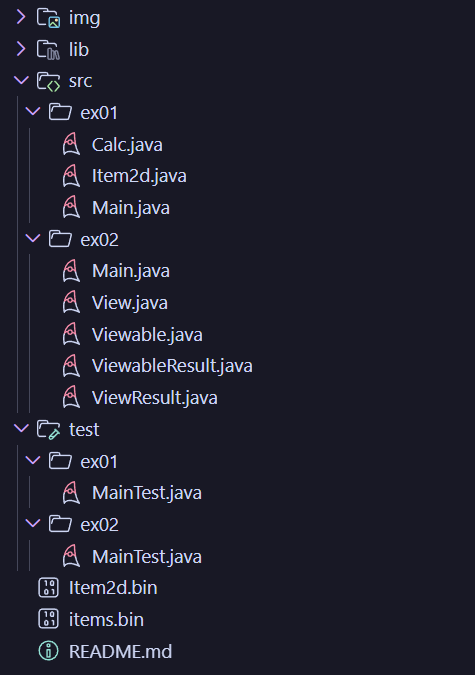
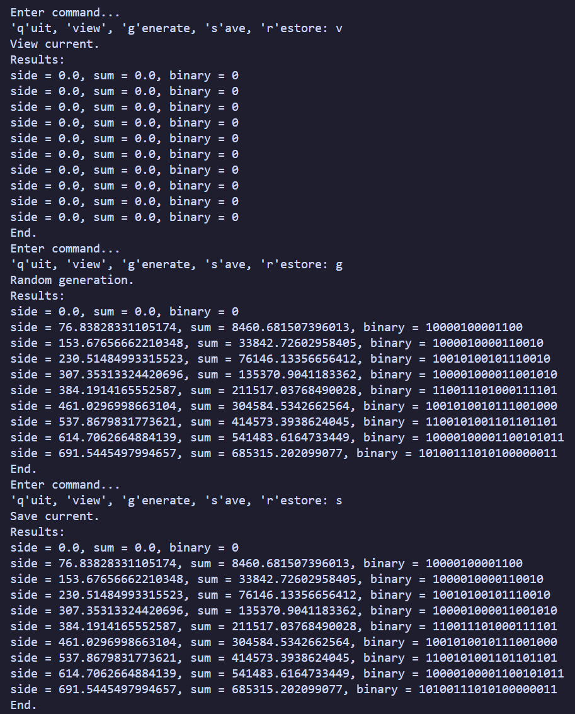
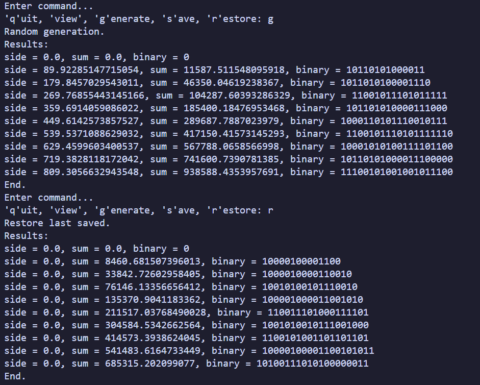
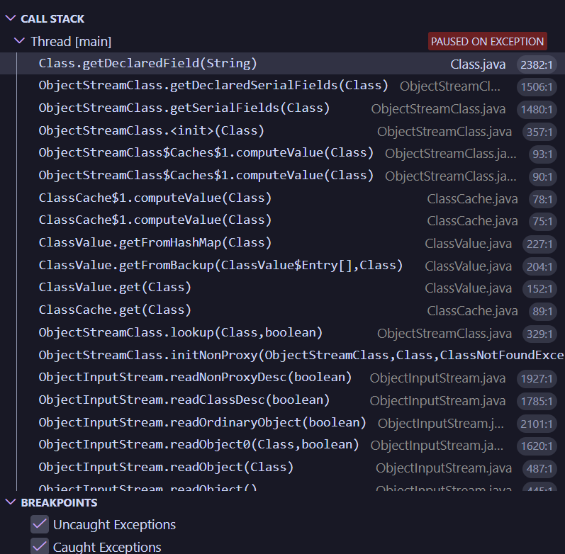
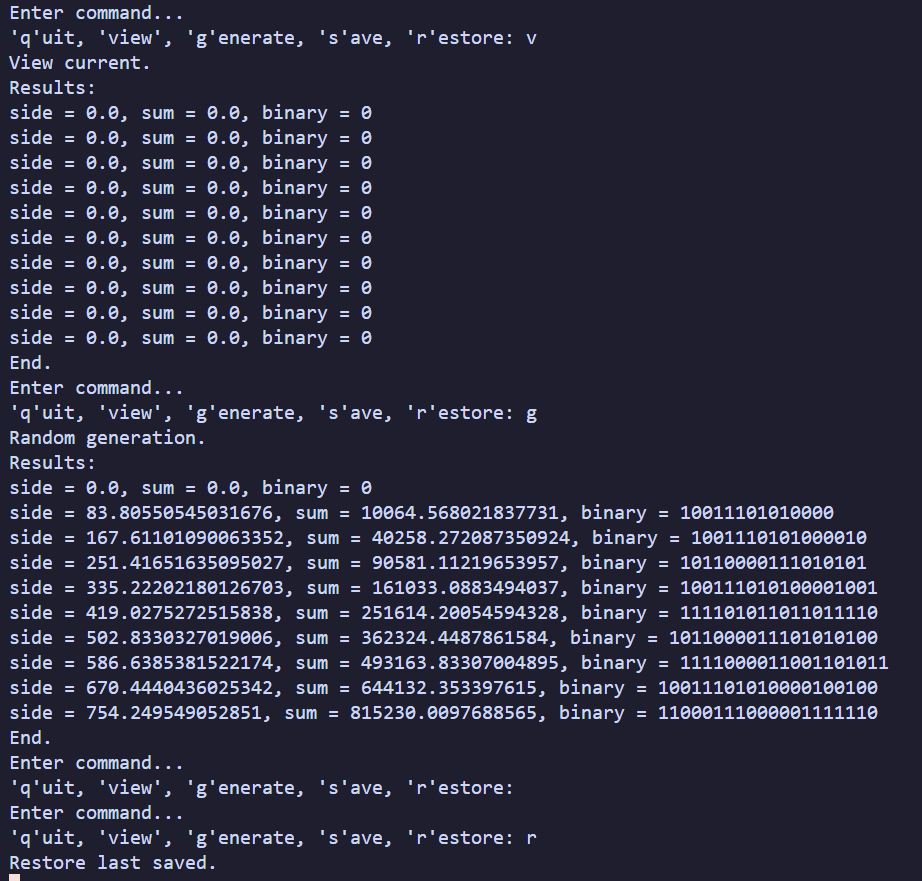
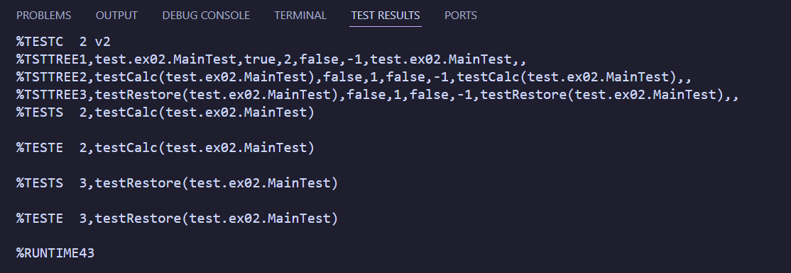
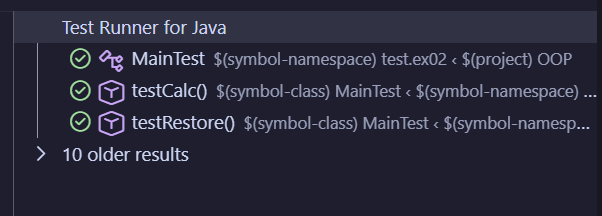

___
# ООП практика - Завдання 3 - Єдалов Артем
# Спадкування. Інтерфейси. Колекції пакету java.util
## Постановка задачі
1. Як основа використовувати вихідний текст проекту попередньої лабораторної роботи. Забезпечити розміщення результатів обчислень уколекції з можливістю збереження/відновлення.
2. Використовуючи шаблон проектування Factory Method (Virtual Constructor), розробити ієрархію, що передбачає розширення рахунок додавання нових відображуваних класів.
3. Розширити ієрархію інтерфейсом "фабрикованих" об'єктів, що представляє набір методів для відображення результатів обчислень.
4. Реалізувати ці методи виведення результатів у текстовому виде.
5. Розробити тареалізувати інтерфейс для "фабрикуючого" методу.
___
# Опис проєкту
### Структура
#### З пакета ```ex01``` (який був створений у ході виконання попередньої практичної) було використано клас ```ex01.Item2d```

### **src\ex01**
#### **Item2d.java** - містить вихідні дані та результати обчислень
<details>
<summary>ПЕРЕГЛЯНУТИ</summary>

```java
package ex01;

import java.io.Serializable;

/**
 * Зберігає вхідні дані та результат обчислень.
 * @author Артем Єдалов
 * @version 1.0
 */
public class Item2d implements Serializable
{
    /** Аргумент обчислюваної функції. Не серіалізується через особливість transient. */
    private transient double x;

    /** Результат обчислення функції. */
    private double y;

    /** Автоматично згенерована константа */
    private static final long serialVersionUID = 1L;

    /** Ініціалізує поля {@linkplain Item2d#x}, {@linkplain Item2d#y} нулями */
    public Item2d()
    { x = .0; y = .0; }

    /**
     * Встановлює значення аргументу та результату.
     * @param x - значення для {@linkplain Item2d#x}
     * @param y - значення для {@linkplain Item2d#y}
     */
    public Item2d(double x, double y)
    { this.x = x; this.y = y; }

    /**
     * Встановлює значення поля {@linkplain Item2d#x}
     * @param x - нове значення
     * @return встановлене значення
     */
    public double setX (double x)
    { return this.x = x; }
    
    /**
     * Встановлює значення поля {@linkplain Item2d#y}
     * @param y - нове значення
     * @return встановлене значення
     */
    public double setY (double y)
    { return this.y = y; }

    /**
     * Отримати значення поля {@linkplain Item2d#x}
     * @return значення x
     */
    public double getX()
    { return this.x; }

    /**
     * Отримати значення поля {@linkplain Item2d#y}
     * @return значення y
     */
    public double getY()
    { return this.y; }

    /**
     * Встановлює обидва поля одночасно.
     * @param x - значення для {@linkplain Item2d#x}
     * @param y - значення для {@linkplain Item2d#y}
     * @return this
     */
    public Item2d setXY(double x, double y)
    { this.x = x; this.y = y; return this; }

    /** Автоматично згенерований метод.<br>{@inheritDoc} */
    @Override
    public boolean equals(Object obj)
    {
        if (this == obj) return true;
        if (obj == null) return false;
        if (getClass() != obj.getClass()) return false;
        Item2d other = (Item2d) obj;
        if (Double.doubleToLongBits(x) != Double.doubleToLongBits(other.x)) return false;
        if (Math.abs(Math.abs(y) - Math.abs(other.y)) > .1e-10) return false;
        return true;
    }

    /** Представляє результат у вигляді рядка з двійковим поданням. {@inheritDoc} */
    @Override
    public String toString()
    {
        long intVal = (long) y;
        return "side = " + x + ", sum = " + y + ", binary = " + Long.toBinaryString(intVal);
    }
}
```
</details>

### **src\ex02**
#### **Main.java** - містить обчислення і відображення результатів та реалізацію статичного метода ```main()```. 2-га версія класу з пакета ```ex01```, що був створений у ході виконання попередньої практичної.
<details>
<summary>ПЕРЕГЛЯНУТИ</summary>

```java
package ex02;

import java.io.IOException;
import java.io.BufferedReader;
import java.io.InputStreamReader;

/** Обчислення та відображення результатів.<br>
 * Містить реалізацію статичного методу main()
 * @author Артем Єдалов
 * @version 2.0
 * @see Main#main
 */
public class Main
{
    /** Об'єкт, що реалізує інтерфейс {@linkplain View};
     * обслуговує колекцію об'єктів {@linkplain ex01.Item2d}
     */
    private View view;

    /** Ініціалізує поле {@linkplain Main#view view}. */
    public Main(View view)
    { this.view = view; }

    /** Відображає меню. */
    protected void menu()
    {
        String s = null;
        BufferedReader in = new BufferedReader(new InputStreamReader(System.in));
        do
        {
            do
            {
                System.out.println("Enter command...");
                System.out.print("'q'uit, 'view', 'g'enerate, 's'ave, 'r'estore: ");
                try { s = in.readLine(); }
                catch(IOException e)
                { System.out.println("Error: " + e); System.exit(0); }
            }
            while (s.length() != 1);

            switch (s.charAt(0))
            {
                case 'q':
                    System.out.println("Exit.");
                    break;
                case 'v':
                    System.out.println("View current.");
                    view.viewShow();
                    break;
                case 'g':
                    System.out.println("Random generation.");
                    view.viewInit();
                    view.viewShow();
                    break;
                case 's':
                    System.out.println("Save current.");
                    try { view.viewSave(); }
                    catch (IOException e) { System.out.println("Serialization error: " + e); }
                    view.viewShow();
                    break;
                case 'r':
                    System.out.println("Restore last saved.");
                    try { view.viewRestore(); }
                    catch (Exception e) { System.out.println("Serialization error: " + e); }
                    view.viewShow();
                    break;
                default:
                    System.out.println("Wrong command.");
            }
        }
        while(s.charAt(0) != 'q');
    }

    /** Виконується при запуску програми;
     * викликає метод {@linkplain Main#menu() menu()}
     * @param args - параметри запуску програми.
     */
    public static void main(String[] args)
    {
        Main main = new Main(new ViewableResult().getView());
        main.menu();
    }
}
```
</details>

#### **View.java** - .
<details>
<summary>ПЕРЕГЛЯНУТИ</summary>

```java
package ex02;

import java.io.IOException;

/** Product
 * (шаблон проектування Factory Method)<br>
 * Інтерфейс "фабрикованих" об'єктів.<br>
 * Оголошує методи відображення об'єктів.
 * @author Артем Єдалов
 * @version 1.0
 */
public interface View
{
    /** Відображає заголовок */
    public void viewHeader();

    /** Відображає основну частину */
    public void viewBody();

    /** Відображає закінчення */
    public void viewFooter();

    /** Відображає об'єкт повністю */
    public void viewShow();

    /** Виконує ініціалізацію */
    public void viewInit();

    /** Зберігає дані для подальшого відновлення */
    public void viewSave() throws IOException;
    
    /** Відновлює раніше збережені дані */
    public void viewRestore() throws Exception;
}
```
</details>

#### **Viewable.java** - .
<details>
<summary>ПЕРЕГЛЯНУТИ</summary>

```java
package ex02;

/** Creator
 * (шаблон проектування Factory Method)<br>
 * Оголошує метод, що "фабрикує" об'єкти.
 * @author Артем Єдалов
 * @version 1.0
 * @see Viewable#getView()
 */
public interface Viewable
{
    /** Створює об'єкт, що реалізує {@linkplain View} */
    public View getView();
}
```
</details>

#### **ViewableResult.java** - .
<details>
<summary>ПЕРЕГЛЯНУТИ</summary>

```java
package ex02;

/** ConcreteCreator
 * (шаблон проектування Factory Method)<br>
 * Оголошує метод, що "фабрикує" об'єкти.
 * @author Артем Єдалов
 * @version 1.0
 * @see Viewable
 * @see ViewableResult#getView()
 */
public class ViewableResult implements Viewable
{
    /** Створює об'єкт відображення {@linkplain ViewResult} */
    @Override
    public View getView()
    { return new ViewResult(); }
}
```
</details>

#### **ViewResult.java** - .
<details>
<summary>ПЕРЕГЛЯНУТИ</summary>

```java
package ex02;

import java.io.FileInputStream;
import java.io.FileOutputStream;
import java.io.IOException;
import java.io.ObjectInputStream;
import java.io.ObjectOutputStream;
import java.util.ArrayList;

import ex01.Item2d;

/**
 * ConcreteProduct
 * (шаблон проектування Factory Method)<br>
 * Обчислення функції, збереження та відображення результатів.
 * @author Артем Єдалов
 * @version 1.0
 * @see View
 */
public class ViewResult implements View
{
    /** Ім'я файлу, що використовується при серіалізації */
    private static final String FNAME = "items.bin";

    /** Визначає кількість значень для обчислення за замовчуванням */
    private static final int DEFAULT_NUM = 10;

    /** Колекція аргументів та результатів обчислень */
    private ArrayList<Item2d> items = new ArrayList<Item2d>();

    /**
     * Викликає {@linkplain ViewResult#ViewResult(int n) ViewResult(int n)}
     * з параметром {@linkplain ViewResult#DEFAULT_NUM DEFAULT_NUM}
     */
    public ViewResult()
    { this(DEFAULT_NUM); }

    /**
     * Ініціалізує колекцію {@linkplain ViewResult#items}
     * @param n початкова кількість елементів
     */
    public ViewResult(int n)
    {
        for(int ctr = 0; ctr < n; ctr++)
            items.add(new Item2d());
    }

    /**
     * Отримати значення {@linkplain ViewResult#items}
     * @return поточне значення посилання на об'єкт {@linkplain ArrayList}
     */
    public ArrayList<Item2d> getItems()
    { return items; }

    /**
     * Обчислює суму площ рівностороннього трикутника та квадрата.
     * @param side довжина сторони
     * @return результат обчислення
     */
    private double calc(double side)
    { return (Math.pow(side, 2) * Math.sqrt(3) / 4.0) + Math.pow(side, 2); }

    /**
     * Обчислює значення функції та зберігає
     * результат у колекції {@linkplain ViewResult#items}
     * @param stepSide крок приросту аргументу
     */
    public void init(double stepSide)
    {
        double side = 0.0;
        for (Item2d item : items)
        {
            item.setXY(side, calc(side));
            side += stepSide;
        }
    }

    /**
     * Викликає <b>init(double stepSide)</b> з випадковим значенням кроку.<br>
     * {@inheritDoc}
     */
    @Override
    public void viewInit()
    { init((Math.random() * 100.0) + 1); }

    /**
     * Реалізація методу {@linkplain View#viewSave()}<br>
     * {@inheritDoc}
     */
    @Override
    public void viewSave() throws IOException
    {
        ObjectOutputStream os = new ObjectOutputStream(new FileOutputStream(FNAME));
        os.writeObject(items);
        os.flush();
        os.close();
    }

    /**
     * Реалізація методу {@linkplain View#viewRestore()}<br>
     * {@inheritDoc}
     */
    @SuppressWarnings("unchecked")
    @Override
    public void viewRestore() throws Exception
    {
        ObjectInputStream is = new ObjectInputStream(new FileInputStream(FNAME));
        items = (ArrayList<Item2d>) is.readObject();
        is.close();
    }

    /**
     * Реалізація методу {@linkplain View#viewHeader()}<br>
     * {@inheritDoc}
     */
    public void viewHeader()
    { System.out.println("Results:"); }

    /**
     * Реалізація методу {@linkplain View#viewBody()}<br>
     * {@inheritDoc}
     */
    @Override
    public void viewBody()
    {
        for(Item2d item : items)
            System.out.println(item);
    }

    /**
     * Реалізація методу {@linkplain View#viewFooter()}<br>
     * {@inheritDoc}
     */
    @Override
    public void viewFooter()
    { System.out.println("End."); }

    /**
     * Реалізація методу {@linkplain View#viewShow()}<br>
     * {@inheritDoc}
     */
    @Override
    public void viewShow()
    {
        viewHeader();
        viewBody();
        viewFooter();
    }
}
```
</details>

### **test\ex02**
#### **MainTest.java** - виконує тестування розроблених класів. 2-га версія класу з пакета ```ex01```, що був створений у ході виконання попередньої практичної.
<details>
<summary>MainTest.java</summary>

```java
package test.ex02;

import org.junit.Test;
import static org.junit.Assert.assertEquals;
import static org.junit.Assert.assertTrue;
import org.junit.Assert;
import java.io.IOException;
import ex01.Item2d;
import ex02.ViewResult;

/**
 * Виконує тестування розроблених класів.
 * @author Артем Єдалов
 * @version 2.0
 */
public class MainTest
{
    /** Перевірка основної функціональності класу {@linkplain ViewResult} */
    @Test
    public void testCalc()
    {
        ViewResult view = new ViewResult(5);
        view.init(1.0);
        Item2d item = new Item2d();
        int ctr = 0;

        item.setXY(0.0, 0.0);
        assertTrue(view.getItems().get(ctr).equals(item));
        ctr++;

        item.setXY(1.0, Math.pow(1,2)*Math.sqrt(3)/4.0 + Math.pow(1,2));
        assertTrue(view.getItems().get(ctr).equals(item));
        ctr++;

        item.setXY(2.0, Math.pow(2,2)*Math.sqrt(3)/4.0 + Math.pow(2,2));
        assertTrue(view.getItems().get(ctr).equals(item));
        ctr++;

        item.setXY(3.0, Math.pow(3,2)*Math.sqrt(3)/4.0 + Math.pow(3,2));
        assertTrue(view.getItems().get(ctr).equals(item));
        ctr++;

        item.setXY(4.0, Math.pow(4,2)*Math.sqrt(3)/4.0 + Math.pow(4,2));
        assertTrue(view.getItems().get(ctr).equals(item));
    }

    /** Перевірка серіалізації. Коректність відновлення даних. */
    @Test
    public void testRestore()
    {
        ViewResult view1 = new ViewResult(1000);
        ViewResult view2 = new ViewResult();
        
        view1.init(Math.random()*100.0);
        try
        { view1.viewSave(); }

        catch (IOException e)
        { Assert.fail(e.getMessage()); }

        try
        { view2.viewRestore(); }

        catch (Exception e)
        { Assert.fail(e.getMessage()); }

        // Повинні завантажити стільки ж елементів, скільки зберегли
        assertEquals(view1.getItems().size(), view2.getItems().size());
        // x є transient — після десеріалізації x = 0.0, тому порівнюємо лише y
        for (int i = 0; i < view1.getItems().size(); i++)
                assertEquals("y mismatch at index " + i, view1.getItems().get(i).getY(), view2.getItems().get(i).getY(), 1e-10);
    }
}
```
</details>

___
# Приклад роботи
### При звичайному запуску:


### При запуску + дебаг (для прикладу демонстрована спроба відновити  не існуюче збереження при увімкнених примусових зупинках неочікуваних виключень):


### Результати тесту через JUnit Test:


___