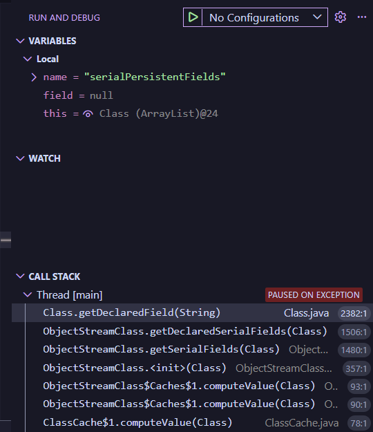
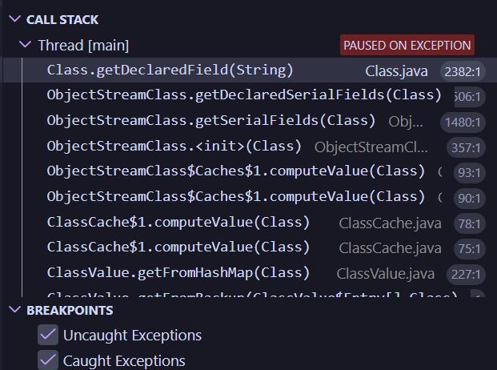

___
# ООП практика - Завдання 5 - Єдалов Артем
# Обробка колекцій. Шаблони Singletone, Command
## Постановка задачі
1. Реалізувати можливість скасування (undo) операцій (команд).
2. Продемонструвати поняття "макрокоманда"
3. При розробці програми використовувати шаблон Singletone.
4. Забезпечити діалоговий інтерфейс із користувачем.
5. Розробити клас для тестування функціональності програми.
___
# Опис проєкту
### Структура
#### З пакетів ```ex01```, ```ex02``` та ```ex03``` (які були створені у ході виконання попередніх практичних) було використано класи ```ex01.Item2d```, ```ex02.ViewResult```, ```ex02.View```  та ```ex03.ViewableTable```

### **src\ex01**
#### **Item2d.java** - містить вихідні дані та результати обчислень
<details>
<summary>ПЕРЕГЛЯНУТИ</summary>

```java
package ex01;

import java.io.Serializable;

/**
 * Зберігає вхідні дані та результат обчислень.
 * @author Артем Єдалов
 * @version 1.0
 */
public class Item2d implements Serializable
{
    /** Аргумент обчислюваної функції. Не серіалізується через особливість transient. */
    private transient double x;

    /** Результат обчислення функції. */
    private double y;

    /** Автоматично згенерована константа */
    private static final long serialVersionUID = 1L;

    /** Ініціалізує поля {@linkplain Item2d#x}, {@linkplain Item2d#y} нулями */
    public Item2d()
    { x = .0; y = .0; }

    /**
     * Встановлює значення аргументу та результату.
     * @param x - значення для {@linkplain Item2d#x}
     * @param y - значення для {@linkplain Item2d#y}
     */
    public Item2d(double x, double y)
    { this.x = x; this.y = y; }

    /**
     * Встановлює значення поля {@linkplain Item2d#x}
     * @param x - нове значення
     * @return встановлене значення
     */
    public double setX (double x)
    { return this.x = x; }
    
    /**
     * Встановлює значення поля {@linkplain Item2d#y}
     * @param y - нове значення
     * @return встановлене значення
     */
    public double setY (double y)
    { return this.y = y; }

    /**
     * Отримати значення поля {@linkplain Item2d#x}
     * @return значення x
     */
    public double getX()
    { return this.x; }

    /**
     * Отримати значення поля {@linkplain Item2d#y}
     * @return значення y
     */
    public double getY()
    { return this.y; }

    /**
     * Встановлює обидва поля одночасно.
     * @param x - значення для {@linkplain Item2d#x}
     * @param y - значення для {@linkplain Item2d#y}
     * @return this
     */
    public Item2d setXY(double x, double y)
    { this.x = x; this.y = y; return this; }

    /** Автоматично згенерований метод.<br>{@inheritDoc} */
    @Override
    public boolean equals(Object obj)
    {
        if (this == obj) return true;
        if (obj == null) return false;
        if (getClass() != obj.getClass()) return false;
        Item2d other = (Item2d) obj;
        if (Double.doubleToLongBits(x) != Double.doubleToLongBits(other.x)) return false;
        if (Math.abs(Math.abs(y) - Math.abs(other.y)) > .1e-10) return false;
        return true;
    }

    /** Представляє результат у вигляді рядка з двійковим поданням. {@inheritDoc} */
    @Override
    public String toString()
    {
        long intVal = (long) y;
        return "side = " + x + ", sum = " + y + ", binary = " + Long.toBinaryString(intVal);
    }
}
```
</details>

### **src\ex02**
#### **ViewResult.java** - реалізує логіку: рахує суми площ, зберігає у ```ArrayList<Item2d>```, серіалізує.
<details>
<summary>ПЕРЕГЛЯНУТИ</summary>

```java
package ex02;

import java.io.FileInputStream;
import java.io.FileOutputStream;
import java.io.IOException;
import java.io.ObjectInputStream;
import java.io.ObjectOutputStream;
import java.util.ArrayList;

import ex01.Item2d;

/**
 * ConcreteProduct
 * (шаблон проектування Factory Method)<br>
 * Обчислення функції, збереження та відображення результатів.
 * @author Артем Єдалов
 * @version 1.0
 * @see View
 */
public class ViewResult implements View
{
    /** Ім'я файлу, що використовується при серіалізації */
    private static final String FNAME = "items.bin";

    /** Визначає кількість значень для обчислення за замовчуванням */
    private static final int DEFAULT_NUM = 10;

    /** Колекція аргументів та результатів обчислень */
    private ArrayList<Item2d> items = new ArrayList<Item2d>();

    /**
     * Викликає {@linkplain ViewResult#ViewResult(int n) ViewResult(int n)}
     * з параметром {@linkplain ViewResult#DEFAULT_NUM DEFAULT_NUM}
     */
    public ViewResult()
    { this(DEFAULT_NUM); }

    /**
     * Ініціалізує колекцію {@linkplain ViewResult#items}
     * @param n початкова кількість елементів
     */
    public ViewResult(int n)
    {
        for(int ctr = 0; ctr < n; ctr++)
            items.add(new Item2d());
    }

    /**
     * Отримати значення {@linkplain ViewResult#items}
     * @return поточне значення посилання на об'єкт {@linkplain ArrayList}
     */
    public ArrayList<Item2d> getItems()
    { return items; }

    /**
     * Обчислює суму площ рівностороннього трикутника та квадрата.
     * @param side довжина сторони
     * @return результат обчислення
     */
    private double calc(double side)
    { return (Math.pow(side, 2) * Math.sqrt(3) / 4.0) + Math.pow(side, 2); }

    /**
     * Обчислює значення функції та зберігає
     * результат у колекції {@linkplain ViewResult#items}
     * @param stepSide крок приросту аргументу
     */
    public void init(double stepSide)
    {
        double side = 0.0;
        for (Item2d item : items)
        {
            item.setXY(side, calc(side));
            side += stepSide;
        }
    }

    /**
     * Викликає <b>init(double stepSide)</b> з випадковим значенням кроку.<br>
     * {@inheritDoc}
     */
    @Override
    public void viewInit()
    { init((Math.random() * 100.0) + 1); }

    /**
     * Реалізація методу {@linkplain View#viewSave()}<br>
     * {@inheritDoc}
     */
    @Override
    public void viewSave() throws IOException
    {
        ObjectOutputStream os = new ObjectOutputStream(new FileOutputStream(FNAME));
        os.writeObject(items);
        os.flush();
        os.close();
    }

    /**
     * Реалізація методу {@linkplain View#viewRestore()}<br>
     * {@inheritDoc}
     */
    @SuppressWarnings("unchecked")
    @Override
    public void viewRestore() throws Exception
    {
        ObjectInputStream is = new ObjectInputStream(new FileInputStream(FNAME));
        items = (ArrayList<Item2d>) is.readObject();
        is.close();
    }

    /**
     * Реалізація методу {@linkplain View#viewHeader()}<br>
     * {@inheritDoc}
     */
    public void viewHeader()
    { System.out.println("Results:"); }

    /**
     * Реалізація методу {@linkplain View#viewBody()}<br>
     * {@inheritDoc}
     */
    @Override
    public void viewBody()
    {
        for(Item2d item : items)
            System.out.println(item);
    }

    /**
     * Реалізація методу {@linkplain View#viewFooter()}<br>
     * {@inheritDoc}
     */
    @Override
    public void viewFooter()
    { System.out.println("End."); }

    /**
     * Реалізація методу {@linkplain View#viewShow()}<br>
     * {@inheritDoc}
     */
    @Override
    public void viewShow()
    {
        viewHeader();
        viewBody();
        viewFooter();
    }
}
```
</details>

```java

```
</details>

#### **View.java** - Шаблон проєктування Factory Method.<br> ConcreteCreator: реалізує фабричний метод ```getView()```, що створює та повертає об'єкт ```ViewResult```.
<details>
<summary>ПЕРЕГЛЯНУТИ</summary>

```java

```
</details>

### **src\ex03**
#### **ViewableTable.java** - Шаблон проєктування Factory Method.<br> ConcreteCreator: реалізує фабричний метод ```getView()```, що створює та повертає об'єкт ```ViewTable```.
<details>
<summary>ПЕРЕГЛЯНУТИ</summary>

```java

```
</details>

### **src\ex04**
#### **Application.java** - 000.
<details>
<summary>ПЕРЕГЛЯНУТИ</summary>

```java

```
</details>

#### **ChangeConsoleCommand.java** - 000.
<details>
<summary>ПЕРЕГЛЯНУТИ</summary>

```java

```
</details>

#### **ChangeItemCommand.java** - 000.
<details>
<summary>ПЕРЕГЛЯНУТИ</summary>

```java

```
</details>

#### **Command.java** - 000.
<details>
<summary>ПЕРЕГЛЯНУТИ</summary>

```java

```
</details>

#### **ConsoleCommand.java** - 000.
<details>
<summary>ПЕРЕГЛЯНУТИ</summary>

```java

```
</details>

#### **GenerateConsoleCommand.java** - 000.
<details>
<summary>ПЕРЕГЛЯНУТИ</summary>

```java

```
</details>

#### **Main.java** - 000.
<details>
<summary>ПЕРЕГЛЯНУТИ</summary>

```java

```
</details>

#### **Menu.java** - 000.
<details>
<summary>ПЕРЕГЛЯНУТИ</summary>

```java

```
</details>

#### **RestoreConsoleCommand.java** - 000.
<details>
<summary>ПЕРЕГЛЯНУТИ</summary>

```java

```
</details>

#### **SaveConsoleCommand.java** - 000.
<details>
<summary>ПЕРЕГЛЯНУТИ</summary>

```java

```
</details>

#### **ViewConsoleCommand.java** - 000.
<details>
<summary>ПЕРЕГЛЯНУТИ</summary>

```java

```
</details>

### **test\ex04**
#### **MainTest.java** - виконує тестування розроблених класів. 3-га версія класу з пакета ```ex01```, що був створений у ході виконання попередньої практичної.
<details>
<summary>MainTest.java</summary>

```java

```
</details>

___
# Приклад роботи
### При звичайному запуску:
```

```
### При запуску + дебаг (для прикладу демонстрована спроба відновити  не існуюче збереження при увімкнених примусових зупинках неочікуваних виключень):


### Результати тесту через JUnit Test:


___