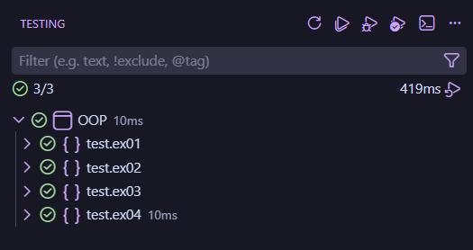

___
# ООП практика - Завдання 5 - Єдалов Артем
# Обробка колекцій. Шаблони Singletone, Command
## Постановка задачі
1. Реалізувати можливість скасування (undo) операцій (команд).
2. Продемонструвати поняття "макрокоманда"
3. При розробці програми використовувати шаблон Singletone.
4. Забезпечити діалоговий інтерфейс із користувачем.
5. Розробити клас для тестування функціональності програми.
___
# Опис проєкту
## Структура
#### З пакетів ```ex01```, ```ex02``` та ```ex03``` (які були створені у ході виконання попередніх практичних) було використано класи ```ex01.Item2d```, ```ex02.ViewResult```, ```ex02.View```  та ```ex03.ViewableTable```

## **src\ex01**
#### **Item2d.java** - містить вихідні дані та результати обчислень
<details>
<summary>ПЕРЕГЛЯНУТИ</summary>

```java
package ex01;

import java.io.Serializable;

/**
 * Зберігає вхідні дані та результат обчислень.
 * @author Артем Єдалов
 * @version 1.0
 */
public class Item2d implements Serializable
{
    /** Аргумент обчислюваної функції. Не серіалізується через особливість transient. */
    private transient double x;

    /** Результат обчислення функції. */
    private double y;

    /** Автоматично згенерована константа */
    private static final long serialVersionUID = 1L;

    /** Ініціалізує поля {@linkplain Item2d#x}, {@linkplain Item2d#y} нулями */
    public Item2d()
    { x = .0; y = .0; }

    /**
     * Встановлює значення аргументу та результату.
     * @param x - значення для {@linkplain Item2d#x}
     * @param y - значення для {@linkplain Item2d#y}
     */
    public Item2d(double x, double y)
    { this.x = x; this.y = y; }

    /**
     * Встановлює значення поля {@linkplain Item2d#x}
     * @param x - нове значення
     * @return встановлене значення
     */
    public double setX (double x)
    { return this.x = x; }
    
    /**
     * Встановлює значення поля {@linkplain Item2d#y}
     * @param y - нове значення
     * @return встановлене значення
     */
    public double setY (double y)
    { return this.y = y; }

    /**
     * Отримати значення поля {@linkplain Item2d#x}
     * @return значення x
     */
    public double getX()
    { return this.x; }

    /**
     * Отримати значення поля {@linkplain Item2d#y}
     * @return значення y
     */
    public double getY()
    { return this.y; }

    /**
     * Встановлює обидва поля одночасно.
     * @param x - значення для {@linkplain Item2d#x}
     * @param y - значення для {@linkplain Item2d#y}
     * @return this
     */
    public Item2d setXY(double x, double y)
    { this.x = x; this.y = y; return this; }

    /** Автоматично згенерований метод.<br>{@inheritDoc} */
    @Override
    public boolean equals(Object obj)
    {
        if (this == obj) return true;
        if (obj == null) return false;
        if (getClass() != obj.getClass()) return false;
        Item2d other = (Item2d) obj;
        if (Double.doubleToLongBits(x) != Double.doubleToLongBits(other.x)) return false;
        if (Math.abs(Math.abs(y) - Math.abs(other.y)) > .1e-10) return false;
        return true;
    }

    /** Представляє результат у вигляді рядка з двійковим поданням. {@inheritDoc} */
    @Override
    public String toString()
    {
        long intVal = (long) y;
        return "side = " + x + ", sum = " + y + ", binary = " + Long.toBinaryString(intVal);
    }
}
```
</details>

## **src\ex02**
#### **ViewResult.java** - реалізує логіку: рахує суми площ, зберігає у ```ArrayList<Item2d>```, серіалізує.
<details>
<summary>ПЕРЕГЛЯНУТИ</summary>

```java
package ex02;

import java.io.FileInputStream;
import java.io.FileOutputStream;
import java.io.IOException;
import java.io.ObjectInputStream;
import java.io.ObjectOutputStream;
import java.util.ArrayList;

import ex01.Item2d;

/**
 * ConcreteProduct
 * (шаблон проектування Factory Method)<br>
 * Обчислення функції, збереження та відображення результатів.
 * @author Артем Єдалов
 * @version 1.0
 * @see View
 */
public class ViewResult implements View
{
    /** Ім'я файлу, що використовується при серіалізації */
    private static final String FNAME = "items.bin";

    /** Визначає кількість значень для обчислення за замовчуванням */
    private static final int DEFAULT_NUM = 10;

    /** Колекція аргументів та результатів обчислень */
    private ArrayList<Item2d> items = new ArrayList<Item2d>();

    /**
     * Викликає {@linkplain ViewResult#ViewResult(int n) ViewResult(int n)}
     * з параметром {@linkplain ViewResult#DEFAULT_NUM DEFAULT_NUM}
     */
    public ViewResult()
    { this(DEFAULT_NUM); }

    /**
     * Ініціалізує колекцію {@linkplain ViewResult#items}
     * @param n початкова кількість елементів
     */
    public ViewResult(int n)
    {
        for(int ctr = 0; ctr < n; ctr++)
            items.add(new Item2d());
    }

    /**
     * Отримати значення {@linkplain ViewResult#items}
     * @return поточне значення посилання на об'єкт {@linkplain ArrayList}
     */
    public ArrayList<Item2d> getItems()
    { return items; }

    /**
     * Обчислює суму площ рівностороннього трикутника та квадрата.
     * @param side довжина сторони
     * @return результат обчислення
     */
    private double calc(double side)
    { return (Math.pow(side, 2) * Math.sqrt(3) / 4.0) + Math.pow(side, 2); }

    /**
     * Обчислює значення функції та зберігає
     * результат у колекції {@linkplain ViewResult#items}
     * @param stepSide крок приросту аргументу
     */
    public void init(double stepSide)
    {
        double side = 0.0;
        for (Item2d item : items)
        {
            item.setXY(side, calc(side));
            side += stepSide;
        }
    }

    /**
     * Викликає <b>init(double stepSide)</b> з випадковим значенням кроку.<br>
     * {@inheritDoc}
     */
    @Override
    public void viewInit()
    { init((Math.random() * 100.0) + 1); }

    /**
     * Реалізація методу {@linkplain View#viewSave()}<br>
     * {@inheritDoc}
     */
    @Override
    public void viewSave() throws IOException
    {
        ObjectOutputStream os = new ObjectOutputStream(new FileOutputStream(FNAME));
        os.writeObject(items);
        os.flush();
        os.close();
    }

    /**
     * Реалізація методу {@linkplain View#viewRestore()}<br>
     * {@inheritDoc}
     */
    @SuppressWarnings("unchecked")
    @Override
    public void viewRestore() throws Exception
    {
        ObjectInputStream is = new ObjectInputStream(new FileInputStream(FNAME));
        items = (ArrayList<Item2d>) is.readObject();
        is.close();
    }

    /**
     * Реалізація методу {@linkplain View#viewHeader()}<br>
     * {@inheritDoc}
     */
    public void viewHeader()
    { System.out.println("Results:"); }

    /**
     * Реалізація методу {@linkplain View#viewBody()}<br>
     * {@inheritDoc}
     */
    @Override
    public void viewBody()
    {
        for(Item2d item : items)
            System.out.println(item);
    }

    /**
     * Реалізація методу {@linkplain View#viewFooter()}<br>
     * {@inheritDoc}
     */
    @Override
    public void viewFooter()
    { System.out.println("End."); }

    /**
     * Реалізація методу {@linkplain View#viewShow()}<br>
     * {@inheritDoc}
     */
    @Override
    public void viewShow()
    {
        viewHeader();
        viewBody();
        viewFooter();
    }
}
```
</details>

#### **View.java** - Шаблон проєктування Factory Method.<br> ConcreteCreator: реалізує фабричний метод ```getView()```, що створює та повертає об'єкт ```ViewResult```.
<details>
<summary>ПЕРЕГЛЯНУТИ</summary>

```java
package ex02;

import java.io.IOException;

/** Product
 * (шаблон проектування Factory Method)<br>
 * Інтерфейс "фабрикованих" об'єктів.<br>
 * Оголошує методи відображення об'єктів.
 * @author Артем Єдалов
 * @version 1.0
 */
public interface View
{
    /** Відображає заголовок */
    public void viewHeader();

    /** Відображає основну частину */
    public void viewBody();

    /** Відображає закінчення */
    public void viewFooter();

    /** Відображає об'єкт повністю */
    public void viewShow();

    /** Виконує ініціалізацію */
    public void viewInit();

    /** Зберігає дані для подальшого відновлення */
    public void viewSave() throws IOException;
    
    /** Відновлює раніше збережені дані */
    public void viewRestore() throws Exception;
}

```
</details>

## **src\ex03**
#### **ViewableTable.java** - Шаблон проєктування Factory Method.<br> ConcreteCreator: реалізує фабричний метод ```getView()```, що створює та повертає об'єкт ```ViewTable```.
<details>
<summary>ПЕРЕГЛЯНУТИ</summary>

```java
package ex03;

import ex02.ViewableResult;
import ex02.View;

/**
 * ConcreteCreator
 * (шаблон проектування Factory Method)<br>
 * Реалізує фабричний метод {@linkplain ViewableTable#getView() getView()},
 * що створює та повертає об'єкт {@linkplain ViewTable}.
 * @author Артем Єдалов
 * @version 1.0
 * @see ViewableResult
 * @see ViewableTable#getView()
 */
public class ViewableTable extends ViewableResult
{
    /** Створює об'єкт відображення {@linkplain ViewTable} */
    @Override
    public View getView()
    { return new ViewTable(); }
}
```
</details>

## **src\ex04**
#### **Application.java** - Формує та відображає меню, реалізує шаблон Singleton.
<details>
<summary>ПЕРЕГЛЯНУТИ</summary>

```java
package ex04;

import ex02.View;
import ex03.ViewableTable;

/**
 * Формує та відображає меню; реалізує шаблон Singleton
 * @author Артем Єдалов
 * @version 1.0
*/
public class Application
{
    /**
     * Посилання на екземпляр класу Application; шаблон Singleton
     * @see Application
    */
    private static Application instance = new Application();

    /**
     * Об'єкт, що реалізує інтерфейс {@linkplain View};
     * обслуговує колекцію об'єктів {@linkplain ex01.Item2d};
     * ініціалізується за допомогою Factory Method
    */
    private View view = new ViewableTable().getView();

    /**
     * Об'єкт класу {@linkplain Menu};
     * макрокоманда (шаблон Command)
    */
    private Menu menu = new Menu();

    /**
     * Закритий конструктор; шаблон Singleton
     * @see Application
    */
    private Application() { }
    
    /**
     * Повертає посилання на екземпляр класу Application; шаблон Singleton
     * @return єдиний екземпляр {@linkplain Application}
     * @see Application
    */
    public static Application getInstance()
    { return instance; }

    /**
     * Обробка команд користувача
     * @see Application
    */
    public void run()
    {
        menu.add(new ViewConsoleCommand(view));
        menu.add(new GenerateConsoleCommand(view));
        menu.add(new ChangeConsoleCommand(view));
        menu.add(new SaveConsoleCommand(view));
        menu.add(new RestoreConsoleCommand(view));
        menu.execute();
    }

    
}
```
</details>

#### **ChangeConsoleCommand.java** - Консольна команда Change Item, шаблон Command.
<details>
<summary>ПЕРЕГЛЯНУТИ</summary>

```java
package ex04;

import ex01.Item2d;
import ex02.View;
import ex02.ViewResult;

/**
 * Консольна команда Change item; шаблон Command
 * @author Артем Єдалов
 * @version 1.0
 */
public class ChangeConsoleCommand extends ChangeItemCommand implements ConsoleCommand
{
    /**
     * Об'єкт, що реалізує інтерфейс {@linkplain View};
     * обслуговує колекцію об'єктів {@linkplain ex01.Item2d}
     */
    private View view;

    /**
     * Повертає поле {@linkplain ChangeConsoleCommand#view}
     * @return значення {@linkplain ChangeConsoleCommand#view}
     */
    public View getView()
    { return view; }

    /**
     * Встановлює поле {@linkplain ChangeConsoleCommand#view}
     * @param view значення для {@linkplain ChangeConsoleCommand#view}
     * @return нове значення {@linkplain ChangeConsoleCommand#view}
     */
    public View setView(View view)
    { return this.view = view; }

    /**
     * Ініціалізує поле {@linkplain ChangeConsoleCommand#view}
     * @param view об'єкт, що реалізує інтерфейс {@linkplain View}
     */
    public ChangeConsoleCommand(View view)
    { this.view = view; }

    /**
     * Скасовує операцію масштабування, ділячи кожне значення на {@linkplain ChangeItemCommand#getOffset() offset}.<br>
     * Після скасування задає значення offset до {@code 1.0}.
     */
    public void undo()
    {
        for (Item2d item : ((ViewResult)view).getItems())
            item.setY(item.getY() / getOffset());
        setOffset(1.0);
        view.viewShow();
    }

    @Override
    public char getKey()
    { return 'c'; }

    @Override
    public String toString()
    { return "'c'hange"; }

    @Override
    public void execute()
    {
        System.out.println("Change item: scale factor " + setOffset(Math.random() * 100.0));
        for (Item2d item : ((ViewResult)view).getItems())
        {
            super.setItem(item);
            super.execute();
        }
        view.viewShow();
    }
}
```
</details>

#### **ChangeItemCommand.java** - Команда Change Item, шаблон Command.
<details>
<summary>ПЕРЕГЛЯНУТИ</summary>

```java
package ex04;

import ex01.Item2d;

/**
 * Команда масштабування елемента; шаблон Command
 * @author Артем Єдалов
 * @version 1.0
 */
public class ChangeItemCommand implements Command
{
    /** Об'єкт що обробляється; шаблон Command */
    private Item2d item;

    /** Параметр команди; шаблон Command */
    private double offset;

    /**
     * Встановлює поле {@linkplain ChangeItemCommand#item}
     * @param item значення для {@linkplain ChangeItemCommand#item}
     * @return нове значення {@linkplain ChangeItemCommand#item}
     */
    public Item2d setItem(Item2d item)
    { return this.item = item; }

    /**
     * Повертає поле {@linkplain ChangeItemCommand#item}
     * @return значення {@linkplain ChangeItemCommand#item}
     */
    public Item2d getItem()
    { return item; }

    /**
     * Встановлює поле {@linkplain ChangeItemCommand#offset}
     * @param offset значення для {@linkplain ChangeItemCommand#offset}
     * @return нове значення {@linkplain ChangeItemCommand#offset}
     */
    public double setOffset(double offset)
    { return this.offset = offset; }

    /**
     * Повертає поле {@linkplain ChangeItemCommand#offset}
     * @return значення {@linkplain ChangeItemCommand#offset}
     */
    public double getOffset()
    { return offset; }

    /** Множить {@linkplain ChangeItemCommand#item}.y на {@linkplain ChangeItemCommand#offset} */
    public void execute()
    { item.setY(item.getY() * offset); }
}

```
</details>

#### **Command.java** - Інтерфейс команди або задачі, шаблони Command та Worker Thread.
<details>
<summary>ПЕРЕГЛЯНУТИ</summary>

```java
package ex04;

/**
 * Інтерфейс команди або задачі;
 * шаблони: Command, Worker Thread
 * @author Артем Єдалов
 * @version 1.0
*/
public interface Command
{
    /** Виконання команди; шаблони: Command, Worker Thread */
    public void execute();    
}
```
</details>

#### **ConsoleCommand.java** - Інтерфейс консольної команди, шаблон Command.
<details>
<summary>ПЕРЕГЛЯНУТИ</summary>

```java
package ex04;

/**
 * Інтерфейс консольної команди; шаблон Command
 * @author Артем Єдалов
 * @version 1.0
*/
public interface ConsoleCommand extends Command
{
    /**
     * Гаряча клавіша команди; шаблон Command
     * @return символ гарячої клавіші
    */
    public char getKey();
}
```
</details>

#### **GenerateConsoleCommand.java** - Консольна команда Generate, шаблон Command.
<details>
<summary>ПЕРЕГЛЯНУТИ</summary>

```java
package ex04;

import ex02.View;

/**
 * Консольна команда Generate; шаблон Command
 * @author Артем Єдалов
 * @version 1.0
 */
public class GenerateConsoleCommand implements ConsoleCommand
{
    /**
     * Об'єкт, що реалізує інтерфейс {@linkplain View};
     * обслуговує колекцію об'єктів {@linkplain ex01.Item2d}
     */
    private View view;

    /**
     * Ініціалізує поле {@linkplain GenerateConsoleCommand#view}
     * @param view об'єкт, що реалізує інтерфейс {@linkplain View}
     */
    public GenerateConsoleCommand(View view)
    { this.view = view; }

    @Override
    public char getKey()
    { return 'g'; }

    @Override
    public String toString()
    { return "'g'enerate"; }

    @Override
    public void execute()
    {
        System.out.println("Random generation.");
        view.viewInit();
        view.viewShow();
    }
}
```
</details>

#### **Main.java** - Обчислення та відображення результатів. Містить реалізацію статичного методу main(). 4-та версія класу, що був розроблений в ході виконання попередніх практичних.
<details>
<summary>ПЕРЕГЛЯНУТИ</summary>

```java
package ex04;

/**
 * Обчислення та відображення результатів.<br>
 * Містить реалізацію статичного методу main()
 * @author Артем Єдалов
 * @version 4.0
 * @see Main#main
 */
public class Main
{
    public static void main(String[] args)
    {
        /**
         * Виконується при запуску програми;
         * викликає метод {@linkplain Application#run()}
         * @param args - параметри запуску програми
        */
        Application app = Application.getInstance();
        app.run();
    }
}
```
</details>

#### **Menu.java** - Макрокоманда (шаблон Command), колекція об'єктів класу ConsoleCommand.
<details>
<summary>ПЕРЕГЛЯНУТИ</summary>

```java
package ex04;

import java.io.BufferedReader;
import java.io.IOException;
import java.io.InputStreamReader;
import java.util.ArrayList;
import java.util.List;

/**
 * Макрокоманда (шаблон Command);<br>
 * Колекція об'єктів класу {@linkplain ConsoleCommand}
 * @author Артем Єдалов
 * @version 1.0
 * @see ConsoleCommand
 */
public class Menu implements Command
{
    /**
     * Колекція консольних команд
     * @see ConsoleCommand
     */
    private List<ConsoleCommand> menu = new ArrayList<ConsoleCommand>();

    /**
     * Додає нову команду до колекції
     * @param command реалізує {@linkplain ConsoleCommand}
     * @return command
     */
    public ConsoleCommand add(ConsoleCommand command)
    {
        menu.add(command);
        return command;
    }

    @Override
    public String toString()
    {
        String s = "Enter command...\n";
        for(ConsoleCommand c: menu)
            s += c + ", ";
        s += "'q'uit: ";
        return s;
    }

    @Override
    public void execute()
    {
        String s = null;
        BufferedReader in = new BufferedReader(new InputStreamReader(System.in));
        menu: while(true)
        {
            do
            {
                System.out.print(this);
                try { s = in.readLine(); }
                catch(IOException e)
                {
                    System.err.println("Error: " + e);
                    System.exit(0);
                }
            }
            while(s.length() != 1);
            char key = s.charAt(0);
            if(key == 'q')
            {
                System.out.println("Exit.");
                break menu;
            }
            for(ConsoleCommand c : menu)
            {
                if (s.charAt(0) == c.getKey())
                {
                    c.execute();
                    continue menu;
                }
            }
            System.out.println("Wrong command.");
            continue menu;
        }
    }
}
```
</details>

#### **RestoreConsoleCommand.java** - Консольна команда Restore, шаблон Command.
<details>
<summary>ПЕРЕГЛЯНУТИ</summary>

```java
package ex04;

import ex02.View;

/**
 * Консольна команда Restore; шаблон Command
 * @author Артем Єдалов
 * @version 1.0
 */
public class RestoreConsoleCommand implements ConsoleCommand
{
    /**
     * Об'єкт, що реалізує інтерфейс {@linkplain View};
     * обслуговує колекцію об'єктів {@linkplain ex01.Item2d}
     */
    private View view;

    /**
     * Ініціалізує поле {@linkplain RestoreConsoleCommand#view}
     * @param view об'єкт, що реалізує інтерфейс {@linkplain View}
     */
    public RestoreConsoleCommand(View view)
    { this.view = view; }

    @Override
    public char getKey()
    { return 'r'; }

    @Override
    public String toString()
    { return "'r'estore"; }

    @Override
    public void execute()
    {
        System.out.println("Restore last saved.");
        try { view.viewRestore(); }
        catch(Exception e) { System.err.println("Serialization error:" + e); }
        view.viewShow();
    }
}
```
</details>

#### **SaveConsoleCommand.java** - Консольна команда Save, шаблон Command.
<details>
<summary>ПЕРЕГЛЯНУТИ</summary>

```java
package ex04;

import java.io.IOException;
import ex02.View;

/**
 * Консольна команда Save; шаблон Command
 * @author Артем Єдалов
 * @version 1.0
 */
public class SaveConsoleCommand implements ConsoleCommand
{
    /**
     * Об'єкт, що реалізує інтерфейс {@linkplain View};
     * обслуговує колекцію об'єктів {@linkplain ex01.Item2d}
     */
    private View view;

    /**
     * Ініціалізує поле {@linkplain SaveConsoleCommand#view}
     * @param view об'єкт, що реалізує інтерфейс {@linkplain View}
     */
    public SaveConsoleCommand(View view)
    { this.view = view; }

    @Override
    public char getKey()
    { return 's'; }

    @Override
    public String toString()
    { return "'s'ave"; }

    @Override
    public void execute()
    {
        System.out.println("Save current.");
        try { view.viewSave(); }
        catch(IOException e)
        { System.err.println("Serialization error: " + e); }
        view.viewShow();
    }
}
```
</details>

#### **UndoConsoleCommand.java** - Консольна команда Undo, шаблон Command.
<details>
<summary>ПЕРЕГЛЯНУТИ</summary>

```java
package ex04;

/**
 * Консольна команда Undo; шаблон Command.<br>
 * @author Артем Єдалов
 * @version 1.0
 * @see ChangeConsoleCommand
 */
public class UndoConsoleCommand implements ConsoleCommand
{
    /** Посилання на команду {@linkplain ChangeConsoleCommand}, операцію якої необхідно скасувати */
    private ChangeConsoleCommand change;

    /**
     * Ініціалізує поле {@linkplain UndoConsoleCommand#change}
     * @param change об'єкт команди {@linkplain ChangeConsoleCommand}
     */
    public UndoConsoleCommand(ChangeConsoleCommand change)
    { this.change = change; }

    @Override
    public char getKey()
    { return 'u'; }

    @Override
    public String toString()
    { return "'u'ndo"; }

    @Override
    public void execute()
    {
        System.out.println("Undo last change");
        change.undo();
    }
}
```
</details>

#### **ViewConsoleCommand.java** - Консольна команда View, шаблон Command.
<details>
<summary>ПЕРЕГЛЯНУТИ</summary>

```java
package ex04;

import ex02.View;

/**
 * Консольна команда View; шаблон Command
 * @author Артем Єдалов
 * @version 1.0
 */
public class ViewConsoleCommand implements ConsoleCommand
{
    /**
     * Об'єкт, що реалізує інтерфейс {@linkplain View};
     * обслуговує колекцію об'єктів {@linkplain ex01.Item2d}
     */
    private View view;

    /**
     * Ініціалізує поле {@linkplain ViewConsoleCommand#view}
     * @param view об'єкт, що реалізує інтерфейс {@linkplain View}
     */
    public ViewConsoleCommand(View view)
    { this.view = view; }

    @Override
    public char getKey()
    { return 'v'; }

    @Override
    public String toString()
    { return "'v'iew"; }

    @Override
    public void execute()
    {
        System.out.println("View current.");
        view.viewShow();
    }
}
```
</details>

## **test\ex04**
#### **MainTest.java** - виконує тестування розроблених класів. 3-га версія класу з пакета ```ex01```, що був створений у ході виконання попередньої практичної.
<details>
<summary>MainTest.java</summary>

```java
package test.ex04;

import static org.junit.Assert.*;
import org.junit.Test;
import ex01.Item2d;
import ex02.ViewResult;
import ex04.ChangeItemCommand;
import ex04.ChangeConsoleCommand;

/**
 * Тестування класу {@linkplain ChangeItemCommand}
 * @author Артем Єдалов
 * @version 4.0
 * @see ChangeItemCommand
 */
public class MainTest
{
    /** Перевірка методу {@linkplain ChangeItemCommand#execute()} */
    @Test
    public void testExecute()
    {
        ChangeItemCommand cmd = new ChangeItemCommand();
        cmd.setItem(new Item2d());
        double x, y, offset;

        for (int ctr = 0; ctr < 1000; ctr++)
        {
            cmd.getItem().setXY(x = Math.random() * 100.0, y = Math.random() * 100.0);
            cmd.setOffset(offset = Math.random() * 100.0);
            cmd.execute();
            assertEquals(x, cmd.getItem().getX(), 1e-10);
            assertEquals(y * offset, cmd.getItem().getY(), 1e-10);
        }
    }

    /** Перевірка основної функціональності класу {@linkplain ChangeConsoleCommand} */
    @Test
    public void testChangeConsoleCommand()
    {
        ChangeConsoleCommand cmd = new ChangeConsoleCommand(new ViewResult());
        cmd.getView().viewInit();
        cmd.execute();
        assertEquals("'c'hange", cmd.toString());
        assertEquals('c', cmd.getKey());
    }
}
```
</details>

___
# Приклад роботи
### При звичайному запуску:
```
Enter command...
'v'iew, 'g'enerate, 'c'hange, 'u'ndo, 's'ave, 'r'estore, 'q'uit: g
Random generation.
Initialization...done.  
   side  | arrea sum 
--------------------
       0 |    0,000
      39 | 2137,031
      77 | 8548,123
     116 | 19233,278
     154 | 34192,494
     193 | 53425,771
     232 | 76933,111
     270 | 104714,512
     309 | 136769,974
     348 | 173099,499
--------------------
Enter command...
'v'iew, 'g'enerate, 'c'hange, 'u'ndo, 's'ave, 'r'estore, 'q'uit: s
Save current.
   side  | arrea sum 
--------------------
       0 |    0,000
      39 | 2137,031
      77 | 8548,123
     116 | 19233,278
     154 | 34192,494
     193 | 53425,771
     232 | 76933,111
     270 | 104714,512
     309 | 136769,974
     348 | 173099,499
--------------------
Enter command...
'v'iew, 'g'enerate, 'c'hange, 'u'ndo, 's'ave, 'r'estore, 'q'uit: c
Change item: scale factor 72.22393225419418
   side  | arrea sum
--------------------
       0 |    0,000
      39 | 154344,771
      77 | 617379,085
     116 | 1389102,941
     154 | 2469516,340
     193 | 3858619,281
     232 | 5556411,765
     270 | 7562893,791
     309 | 9878065,360
     348 | 12501926,471
--------------------
Enter command...
'v'iew, 'g'enerate, 'c'hange, 'u'ndo, 's'ave, 'r'estore, 'q'uit: g
Random generation.
Initialization...done.
   side  | arrea sum
--------------------
       0 |    0,000
      66 | 6282,596
     132 | 25130,384
     199 | 56543,365
     265 | 100521,538
     331 | 157064,903
     397 | 226173,460
     463 | 307847,209
     530 | 402086,151
     596 | 508890,285
--------------------
Enter command...
'v'iew, 'g'enerate, 'c'hange, 'u'ndo, 's'ave, 'r'estore, 'q'uit: c
Change item: scale factor 66.55257145438489
   side  | arrea sum
--------------------
       0 |    0,000
      66 | 418122,926
     132 | 1672491,706
     199 | 3763106,338
     265 | 6689966,824
     331 | 10453073,162
     397 | 15052425,353
     463 | 20488023,397
     530 | 26759867,294
     596 | 33867957,044
--------------------
Enter command...
'v'iew, 'g'enerate, 'c'hange, 'u'ndo, 's'ave, 'r'estore, 'q'uit: u
Undo last change
   side  | arrea sum
--------------------
       0 |    0,000
      66 | 6282,596
     132 | 25130,384
     199 | 56543,365
     265 | 100521,538
     331 | 157064,903
     397 | 226173,460
     463 | 307847,209
     530 | 402086,151
     596 | 508890,285
--------------------
Enter command...
'v'iew, 'g'enerate, 'c'hange, 'u'ndo, 's'ave, 'r'estore, 'q'uit: c
      66 | 6282,596
     132 | 25130,384
     199 | 56543,365
     265 | 100521,538
     331 | 157064,903
     397 | 226173,460
     463 | 307847,209
     530 | 402086,151
     596 | 508890,285
--------------------
Enter command...
'v'iew, 'g'enerate, 'c'hange, 'u'ndo, 's'ave, 'r'estore, 'q'uit: c
     199 | 56543,365
     265 | 100521,538
     331 | 157064,903
     397 | 226173,460
     463 | 307847,209
     530 | 402086,151
     596 | 508890,285
--------------------
Enter command...
'v'iew, 'g'enerate, 'c'hange, 'u'ndo, 's'ave, 'r'estore, 'q'uit: c
     463 | 307847,209
     530 | 402086,151
     596 | 508890,285
--------------------
Enter command...
'v'iew, 'g'enerate, 'c'hange, 'u'ndo, 's'ave, 'r'estore, 'q'uit: c
Change item: scale factor 74.82442199169874
   side  | arrea sum
--------------------
       0 |    0,000
      66 | 470091,622
     132 | 1880366,490
Change item: scale factor 74.82442199169874
   side  | arrea sum
--------------------
       0 |    0,000
      66 | 470091,622
     132 | 1880366,490
     199 | 4230824,602
     265 | 7521465,960
     331 | 11752290,562
     397 | 16923298,409
     463 | 23034489,501
     530 | 30085863,838
     596 | 38077421,420
     199 | 4230824,602
     265 | 7521465,960
     331 | 11752290,562
     397 | 16923298,409
     463 | 23034489,501
     530 | 30085863,838
     596 | 38077421,420
--------------------
Enter command...
     463 | 23034489,501
     530 | 30085863,838
     596 | 38077421,420
--------------------
Enter command...
'v'iew, 'g'enerate, 'c'hange, 'u'ndo, 's'ave, 'r'estore, 'q'uit: r
Restore last saved.
--------------------
Enter command...
'v'iew, 'g'enerate, 'c'hange, 'u'ndo, 's'ave, 'r'estore, 'q'uit: r
Restore last saved.
   side  | arrea sum
--------------------
'v'iew, 'g'enerate, 'c'hange, 'u'ndo, 's'ave, 'r'estore, 'q'uit: r
Restore last saved.
   side  | arrea sum
--------------------
       0 |    0,000
   side  | arrea sum
--------------------
       0 |    0,000
       0 | 2137,031
       0 |    0,000
       0 | 2137,031
       0 | 2137,031
       0 | 8548,123
       0 | 19233,278
       0 | 34192,494
       0 | 53425,771
       0 | 76933,111
       0 | 104714,512
       0 | 136769,974
       0 | 173099,499
--------------------
```
### При запуску + дебаг (для прикладу демонстрована спроба відновити  не існуюче збереження при увімкнених примусових зупинках неочікуваних виключень):
```
Enter command...
'v'iew, 'g'enerate, 'c'hange, 'u'ndo, 's'ave, 'r'estore, 'q'uit: u
Undo last change
   side  | arrea sum 
--------------------
       0 |      NaN
       0 |      NaN
       0 |      NaN
       0 |      NaN
       0 |      NaN
       0 |      NaN
       0 |      NaN
       0 |      NaN
       0 |      NaN
       0 |      NaN
--------------------
Enter command...
'v'iew, 'g'enerate, 'c'hange, 'u'ndo, 's'ave, 'r'estore, 'q'uit: c
Change item: scale factor 98.12189704437093
   side  | arrea sum 
--------------------
       0 |      NaN
       0 |      NaN
       0 |      NaN
       0 |      NaN
       0 |      NaN
       0 |      NaN
       0 |      NaN
       0 |      NaN
       0 |      NaN
       0 |      NaN
--------------------
Enter command...
'v'iew, 'g'enerate, 'c'hange, 'u'ndo, 's'ave, 'r'estore, 'q'uit: g
Random generation.
Initialization...done.
   side  | arrea sum
--------------------
       0 |    0,000
      89 | 11422,426
     179 | 45689,706
     268 | 102801,838
     357 | 182758,822
     446 | 285560,660
     536 | 411207,350
     625 | 559698,893
     714 | 731035,289
     804 | 925216,538
--------------------
Enter command...
'v'iew, 'g'enerate, 'c'hange, 'u'ndo, 's'ave, 'r'estore, 'q'uit: u
Undo last change
   side  | arrea sum
--------------------
       0 |    0,000
      89 |  116,411
     179 |  465,642
     268 | 1047,695
     357 | 1862,569
     446 | 2910,264
     536 | 4190,781
     625 | 5704,118
     714 | 7450,277
     804 | 9429,257
--------------------
Enter command...
'v'iew, 'g'enerate, 'c'hange, 'u'ndo, 's'ave, 'r'estore, 'q'uit: r
Restore last saved.
```

### Результати тесту через JUnit Test:



___