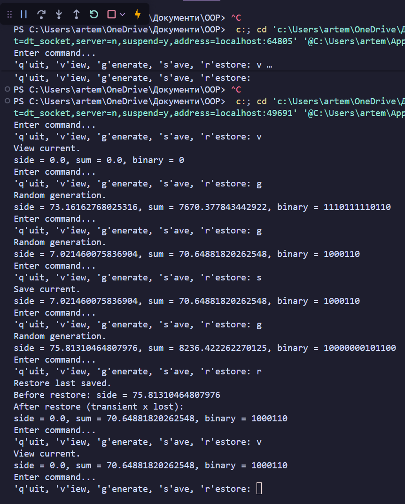
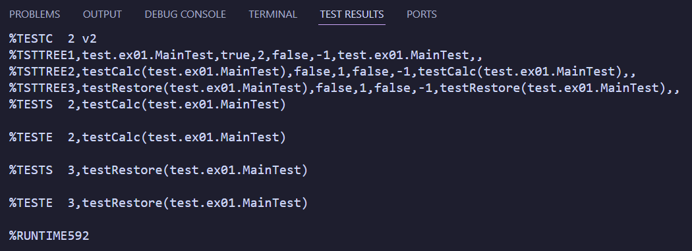
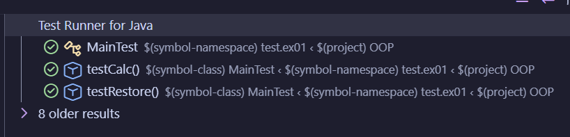

___
# ООП практика - Завдання 2 - Єдалов Артем
# Класи та об'єкти. Агрегування. Серіалізація
## Постановка задачі
### Визначити суму площ рівностороннього трикутника та рівностороннього прямокутника за заданою довжиною сторони у двійковій системі числення.
1. Розробити клас, що серіалізується, для зберігання параметрів і результатів обчислень. Використовуючи агрегування, розробити клас для знаходження рішення задачі.
2. Розробити клас для демонстрації в діалоговому режимі збереження та відновлення стану об'єкта, використовуючи серіалізацію. Показати особливості використання transient полів.
3. Розробити клас для тестування коректності результатів обчислень та серіалізації/десеріалізації.
___
# Опис проєкту
### Структура

> **src\ex01**
> * **Calc.java** - містить реалізацію методів для обчислення задачі і відображення результатів 
<details>
<summary>Calc.java</summary>

```java
package ex01;

import java.io.IOException;
import java.io.FileInputStream;
import java.io.FileOutputStream;
import java.io.ObjectInputStream;
import java.io.ObjectOutputStream;

/**
 * Містить реалізацію методів для обчислення та відображення результатів.
 * @author Артем Єдалов
 * @version 1.0
 */
public class Calc
{
    /** Ім'я файлу, що використовується при серіалізації. */
    private static final String FNAME = "Item2d.bin";

    /** Зберігає результат обчислень. Об'єкт класу {@linkplain Item2d} */
    private Item2d result;

    /** Ініціалізує {@linkplain Calc#result} */
    public Calc()
    { result = new Item2d(); }

    /**
     * Встановити значення {@linkplain Calc#result}
     * @param result - нове значення посилання на об'єкт {@linkplain Item2d}
     */
    public void setResult(Item2d result)
    { this.result = result; }

    /**
     * Отримати значення {@linkplain Calc#result}
     * @return поточне значення посилання на об'єкт {@linkplain Item2d}
     */
    public Item2d getResult()
    { return result; }

    /**
     * Обчислює площу рівностороннього трикутника.
     * @param side - довжина сторони
     * @return площа трикутника
     */
    private double triangleS(double side)
    { return (Math.pow(side, 2) * Math.sqrt(3) / 4.0); }

    /**
     * Обчислює площу рівностороннього прямокутника, або ж квадрата.
     * @param side - довжина сторони
     * @return площа квадрата
     */
    private double rectangleS(double side)
    { return Math.pow(side, 2); }

    /**
     * Обчислює суму площ та зберігає результат в {@linkplain Calc#result}
     * @param side - довжина сторони
     * @return результат обчислення
     */
    public double init(double side)
    {
        result.setX(side);
        return result.setY(triangleS(side) + rectangleS(side));
    }

    /** Виводить результат обчислень. */
    public void show()
    { System.out.println(result); }

    /**
     * Зберігає {@linkplain Calc#result} у файлі {@linkplain Calc#FNAME}
     * @throws IOException
     */
    public void save() throws IOException
    {
        ObjectOutputStream os = new ObjectOutputStream(new FileOutputStream(FNAME));
        os.writeObject(result);
        os.flush();
        os.close();
    }

    /**
     * Відновлює {@linkplain Calc#result} з файлу {@linkplain Calc#FNAME}
     * @throws Exception
     */
    public void restore() throws Exception
    {
        ObjectInputStream is = new ObjectInputStream(new FileInputStream(FNAME));
        result = (Item2d) is.readObject();
        is.close();
    }
}
```

</details>
> * **Item2d.java** - містить вихідні дані та результати обчислень
> * **Main.java** - містить обчислення і відображення результатів та реалізацію статичного метода main()
> **test\ex01**
> * **Main.java** - виконує тестування розроблених класів
___
# Приклад роботи
### При звичайному запуску:

### При запуску + дебаг:

### Результати тесту через JUnit Test:


___