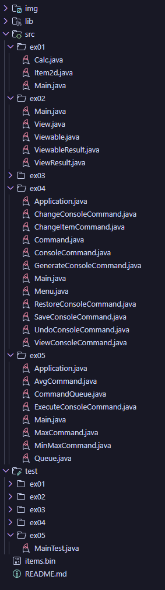
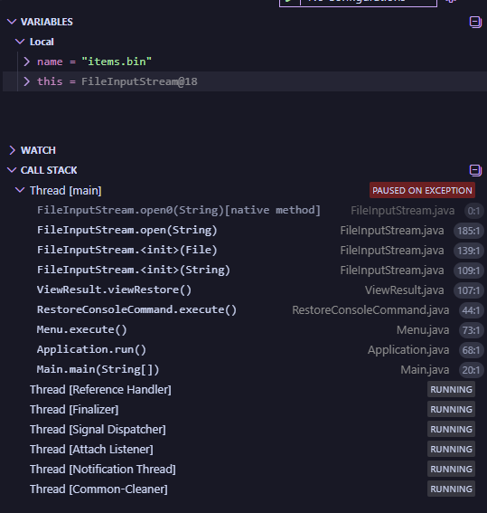
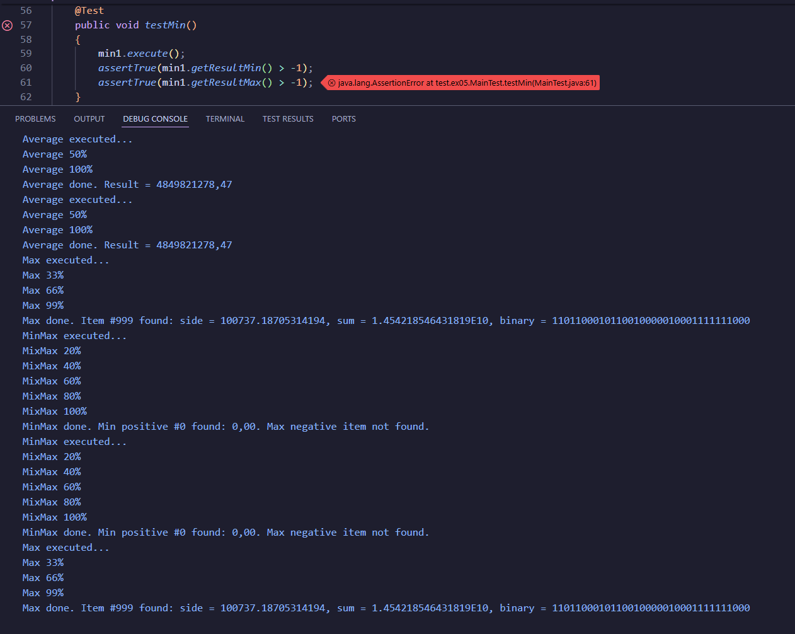

___
# ООП практика - Завдання 6 - Єдалов Артем
# Паралельне виконання. Шаблон Worker Thread
## Постановка задачі
1. Продемонструвати можливість паралельної обробки елементів колекції (пошук мінімуму, максимуму, обчислення середнього значення, відбір за критерієм, статистична обробка тощо).
2. Управління чергою завдань (команд) реалізувати за допомогою шаблону Worker Thread.
___
# Опис проєкту
## Структура
#### З пакетів ```ex01```, ```ex02``` та ```ex04``` (які були створені у ході виконання попередніх практичних) було використано класи ```ex01.Item2d```, ```ex02.ViewResult```, ```ex02.ViewableResult```, ```ex02.View```, ```ex04.Command```, ```ex04.ConsoleCommand```, ```ex04.ChangeConsoleCommand```, ```ex04.GenerateConsoleCommand```, ```ex04.ViewConsoleCommand```, ```ex04.UndoConsoleCommand```, ```ex04.RestoreConsoleCommand```, ```ex04.SaveConsoleCommand``` та ```ex04.Menu```

## **src\ex01**
#### **Item2d.java** - містить вихідні дані та результати обчислень
<details>
<summary>ПЕРЕГЛЯНУТИ</summary>

```java
package ex01;

import java.io.Serializable;

/**
 * Зберігає вхідні дані та результат обчислень.
 * @author Артем Єдалов
 * @version 1.0
 */
public class Item2d implements Serializable
{
    /** Аргумент обчислюваної функції. Не серіалізується через особливість transient. */
    private transient double x;

    /** Результат обчислення функції. */
    private double y;

    /** Автоматично згенерована константа */
    private static final long serialVersionUID = 1L;

    /** Ініціалізує поля {@linkplain Item2d#x}, {@linkplain Item2d#y} нулями */
    public Item2d()
    { x = .0; y = .0; }

    /**
     * Встановлює значення аргументу та результату.
     * @param x - значення для {@linkplain Item2d#x}
     * @param y - значення для {@linkplain Item2d#y}
     */
    public Item2d(double x, double y)
    { this.x = x; this.y = y; }

    /**
     * Встановлює значення поля {@linkplain Item2d#x}
     * @param x - нове значення
     * @return встановлене значення
     */
    public double setX (double x)
    { return this.x = x; }
    
    /**
     * Встановлює значення поля {@linkplain Item2d#y}
     * @param y - нове значення
     * @return встановлене значення
     */
    public double setY (double y)
    { return this.y = y; }

    /**
     * Отримати значення поля {@linkplain Item2d#x}
     * @return значення x
     */
    public double getX()
    { return this.x; }

    /**
     * Отримати значення поля {@linkplain Item2d#y}
     * @return значення y
     */
    public double getY()
    { return this.y; }

    /**
     * Встановлює обидва поля одночасно.
     * @param x - значення для {@linkplain Item2d#x}
     * @param y - значення для {@linkplain Item2d#y}
     * @return this
     */
    public Item2d setXY(double x, double y)
    { this.x = x; this.y = y; return this; }

    /** Автоматично згенерований метод.<br>{@inheritDoc} */
    @Override
    public boolean equals(Object obj)
    {
        if (this == obj) return true;
        if (obj == null) return false;
        if (getClass() != obj.getClass()) return false;
        Item2d other = (Item2d) obj;
        if (Double.doubleToLongBits(x) != Double.doubleToLongBits(other.x)) return false;
        if (Math.abs(Math.abs(y) - Math.abs(other.y)) > .1e-10) return false;
        return true;
    }

    /** Представляє результат у вигляді рядка з двійковим поданням. {@inheritDoc} */
    @Override
    public String toString()
    {
        long intVal = (long) y;
        return "side = " + x + ", sum = " + y + ", binary = " + Long.toBinaryString(intVal);
    }
}
```
</details>

## **src\ex02**
#### **ViewResult.java** - реалізує логіку: рахує суми площ, зберігає у ```ArrayList<Item2d>```, серіалізує.
<details>
<summary>ПЕРЕГЛЯНУТИ</summary>

```java
package ex02;

import java.io.FileInputStream;
import java.io.FileOutputStream;
import java.io.IOException;
import java.io.ObjectInputStream;
import java.io.ObjectOutputStream;
import java.util.ArrayList;

import ex01.Item2d;

/**
 * ConcreteProduct
 * (шаблон проектування Factory Method)<br>
 * Обчислення функції, збереження та відображення результатів.
 * @author Артем Єдалов
 * @version 1.0
 * @see View
 */
public class ViewResult implements View
{
    /** Ім'я файлу, що використовується при серіалізації */
    private static final String FNAME = "items.bin";

    /** Визначає кількість значень для обчислення за замовчуванням */
    private static final int DEFAULT_NUM = 10;

    /** Колекція аргументів та результатів обчислень */
    private ArrayList<Item2d> items = new ArrayList<Item2d>();

    /**
     * Викликає {@linkplain ViewResult#ViewResult(int n) ViewResult(int n)}
     * з параметром {@linkplain ViewResult#DEFAULT_NUM DEFAULT_NUM}
     */
    public ViewResult()
    { this(DEFAULT_NUM); }

    /**
     * Ініціалізує колекцію {@linkplain ViewResult#items}
     * @param n початкова кількість елементів
     */
    public ViewResult(int n)
    {
        for(int ctr = 0; ctr < n; ctr++)
            items.add(new Item2d());
    }

    /**
     * Отримати значення {@linkplain ViewResult#items}
     * @return поточне значення посилання на об'єкт {@linkplain ArrayList}
     */
    public ArrayList<Item2d> getItems()
    { return items; }

    /**
     * Обчислює суму площ рівностороннього трикутника та квадрата.
     * @param side довжина сторони
     * @return результат обчислення
     */
    private double calc(double side)
    { return (Math.pow(side, 2) * Math.sqrt(3) / 4.0) + Math.pow(side, 2); }

    /**
     * Обчислює значення функції та зберігає
     * результат у колекції {@linkplain ViewResult#items}
     * @param stepSide крок приросту аргументу
     */
    public void init(double stepSide)
    {
        double side = 0.0;
        for (Item2d item : items)
        {
            item.setXY(side, calc(side));
            side += stepSide;
        }
    }

    /**
     * Викликає <b>init(double stepSide)</b> з випадковим значенням кроку.<br>
     * {@inheritDoc}
     */
    @Override
    public void viewInit()
    { init((Math.random() * 100.0) + 1); }

    /**
     * Реалізація методу {@linkplain View#viewSave()}<br>
     * {@inheritDoc}
     */
    @Override
    public void viewSave() throws IOException
    {
        ObjectOutputStream os = new ObjectOutputStream(new FileOutputStream(FNAME));
        os.writeObject(items);
        os.flush();
        os.close();
    }

    /**
     * Реалізація методу {@linkplain View#viewRestore()}<br>
     * {@inheritDoc}
     */
    @SuppressWarnings("unchecked")
    @Override
    public void viewRestore() throws Exception
    {
        ObjectInputStream is = new ObjectInputStream(new FileInputStream(FNAME));
        items = (ArrayList<Item2d>) is.readObject();
        is.close();
    }

    /**
     * Реалізація методу {@linkplain View#viewHeader()}<br>
     * {@inheritDoc}
     */
    public void viewHeader()
    { System.out.println("Results:"); }

    /**
     * Реалізація методу {@linkplain View#viewBody()}<br>
     * {@inheritDoc}
     */
    @Override
    public void viewBody()
    {
        for(Item2d item : items)
            System.out.println(item);
    }

    /**
     * Реалізація методу {@linkplain View#viewFooter()}<br>
     * {@inheritDoc}
     */
    @Override
    public void viewFooter()
    { System.out.println("End."); }

    /**
     * Реалізація методу {@linkplain View#viewShow()}<br>
     * {@inheritDoc}
     */
    @Override
    public void viewShow()
    {
        viewHeader();
        viewBody();
        viewFooter();
    }
}
```
</details>

#### **ViewableResult.java** - Шаблон проєктування Factory Method.<br> ConcreteCreator: реалізує фабричний метод ```getView()```, що створює та повертає об'єкт ```ViewResult```.
<details>
<summary>ПЕРЕГЛЯНУТИ</summary>

```java
package ex02;

/** ConcreteCreator
 * (шаблон проектування Factory Method)<br>
 * Оголошує метод, що "фабрикує" об'єкти.
 * @author Артем Єдалов
 * @version 1.0
 * @see Viewable
 * @see ViewableResult#getView()
 */
public class ViewableResult implements Viewable
{
    /** Створює об'єкт відображення {@linkplain ViewResult} */
    @Override
    public View getView()
    { return new ViewResult(); }
}
```
</details>

#### **View.java** - Шаблон проєктування Factory Method.<br> ConcreteCreator: реалізує фабричний метод ```getView()```, що створює та повертає об'єкт ```ViewResult```.
<details>
<summary>ПЕРЕГЛЯНУТИ</summary>

```java
package ex02;

import java.io.IOException;

/** Product
 * (шаблон проектування Factory Method)<br>
 * Інтерфейс "фабрикованих" об'єктів.<br>
 * Оголошує методи відображення об'єктів.
 * @author Артем Єдалов
 * @version 1.0
 */
public interface View
{
    /** Відображає заголовок */
    public void viewHeader();

    /** Відображає основну частину */
    public void viewBody();

    /** Відображає закінчення */
    public void viewFooter();

    /** Відображає об'єкт повністю */
    public void viewShow();

    /** Виконує ініціалізацію */
    public void viewInit();

    /** Зберігає дані для подальшого відновлення */
    public void viewSave() throws IOException;
    
    /** Відновлює раніше збережені дані */
    public void viewRestore() throws Exception;
}

```
</details>

## **src\ex04**
#### **ChangeConsoleCommand.java** - Консольна команда Change Item, шаблон Command.
<details>
<summary>ПЕРЕГЛЯНУТИ</summary>

```java
package ex04;

import ex01.Item2d;
import ex02.View;
import ex02.ViewResult;

/**
 * Консольна команда Change item; шаблон Command
 * @author Артем Єдалов
 * @version 1.0
 */
public class ChangeConsoleCommand extends ChangeItemCommand implements ConsoleCommand
{
    /**
     * Об'єкт, що реалізує інтерфейс {@linkplain View};
     * обслуговує колекцію об'єктів {@linkplain ex01.Item2d}
     */
    private View view;

    /**
     * Повертає поле {@linkplain ChangeConsoleCommand#view}
     * @return значення {@linkplain ChangeConsoleCommand#view}
     */
    public View getView()
    { return view; }

    /**
     * Встановлює поле {@linkplain ChangeConsoleCommand#view}
     * @param view значення для {@linkplain ChangeConsoleCommand#view}
     * @return нове значення {@linkplain ChangeConsoleCommand#view}
     */
    public View setView(View view)
    { return this.view = view; }

    /**
     * Ініціалізує поле {@linkplain ChangeConsoleCommand#view}
     * @param view об'єкт, що реалізує інтерфейс {@linkplain View}
     */
    public ChangeConsoleCommand(View view)
    { this.view = view; }

    /**
     * Скасовує операцію масштабування, ділячи кожне значення на {@linkplain ChangeItemCommand#getOffset() offset}.<br>
     * Після скасування задає значення offset до {@code 1.0}.
     */
    public void undo()
    {
        for (Item2d item : ((ViewResult)view).getItems())
            item.setY(item.getY() / getOffset());
        setOffset(1.0);
        view.viewShow();
    }

    @Override
    public char getKey()
    { return 'c'; }

    @Override
    public String toString()
    { return "'c'hange"; }

    @Override
    public void execute()
    {
        System.out.println("Change item: scale factor " + setOffset(Math.random() * 100.0));
        for (Item2d item : ((ViewResult)view).getItems())
        {
            super.setItem(item);
            super.execute();
        }
        view.viewShow();
    }
}
```
</details>

#### **Command.java** - Інтерфейс команди або задачі, шаблони Command та Worker Thread.
<details>
<summary>ПЕРЕГЛЯНУТИ</summary>

```java
package ex04;

/**
 * Інтерфейс команди або задачі;
 * шаблони: Command, Worker Thread
 * @author Артем Єдалов
 * @version 1.0
*/
public interface Command
{
    /** Виконання команди; шаблони: Command, Worker Thread */
    public void execute();    
}
```
</details>

#### **ConsoleCommand.java** - Інтерфейс консольної команди, шаблон Command.
<details>
<summary>ПЕРЕГЛЯНУТИ</summary>

```java
package ex04;

/**
 * Інтерфейс консольної команди; шаблон Command
 * @author Артем Єдалов
 * @version 1.0
*/
public interface ConsoleCommand extends Command
{
    /**
     * Гаряча клавіша команди; шаблон Command
     * @return символ гарячої клавіші
    */
    public char getKey();
}
```
</details>

#### **GenerateConsoleCommand.java** - Консольна команда Generate, шаблон Command.
<details>
<summary>ПЕРЕГЛЯНУТИ</summary>

```java
package ex04;

import ex02.View;

/**
 * Консольна команда Generate; шаблон Command
 * @author Артем Єдалов
 * @version 1.0
 */
public class GenerateConsoleCommand implements ConsoleCommand
{
    /**
     * Об'єкт, що реалізує інтерфейс {@linkplain View};
     * обслуговує колекцію об'єктів {@linkplain ex01.Item2d}
     */
    private View view;

    /**
     * Ініціалізує поле {@linkplain GenerateConsoleCommand#view}
     * @param view об'єкт, що реалізує інтерфейс {@linkplain View}
     */
    public GenerateConsoleCommand(View view)
    { this.view = view; }

    @Override
    public char getKey()
    { return 'g'; }

    @Override
    public String toString()
    { return "'g'enerate"; }

    @Override
    public void execute()
    {
        System.out.println("Random generation.");
        view.viewInit();
        view.viewShow();
    }
}
```
</details>

#### **Menu.java** - Макрокоманда (шаблон Command), колекція об'єктів класу ConsoleCommand.
<details>
<summary>ПЕРЕГЛЯНУТИ</summary>

```java
package ex04;

import java.io.BufferedReader;
import java.io.IOException;
import java.io.InputStreamReader;
import java.util.ArrayList;
import java.util.List;

/**
 * Макрокоманда (шаблон Command);<br>
 * Колекція об'єктів класу {@linkplain ConsoleCommand}
 * @author Артем Єдалов
 * @version 1.0
 * @see ConsoleCommand
 */
public class Menu implements Command
{
    /**
     * Колекція консольних команд
     * @see ConsoleCommand
     */
    private List<ConsoleCommand> menu = new ArrayList<ConsoleCommand>();

    /**
     * Додає нову команду до колекції
     * @param command реалізує {@linkplain ConsoleCommand}
     * @return command
     */
    public ConsoleCommand add(ConsoleCommand command)
    {
        menu.add(command);
        return command;
    }

    @Override
    public String toString()
    {
        String s = "Enter command...\n";
        for(ConsoleCommand c: menu)
            s += c + ", ";
        s += "'q'uit: ";
        return s;
    }

    @Override
    public void execute()
    {
        String s = null;
        BufferedReader in = new BufferedReader(new InputStreamReader(System.in));
        menu: while(true)
        {
            do
            {
                System.out.print(this);
                try { s = in.readLine(); }
                catch(IOException e)
                {
                    System.err.println("Error: " + e);
                    System.exit(0);
                }
            }
            while(s.length() != 1);
            char key = s.charAt(0);
            if(key == 'q')
            {
                System.out.println("Exit.");
                break menu;
            }
            for(ConsoleCommand c : menu)
            {
                if (s.charAt(0) == c.getKey())
                {
                    c.execute();
                    continue menu;
                }
            }
            System.out.println("Wrong command.");
            continue menu;
        }
    }
}
```
</details>

#### **RestoreConsoleCommand.java** - Консольна команда Restore, шаблон Command.
<details>
<summary>ПЕРЕГЛЯНУТИ</summary>

```java
package ex04;

import ex02.View;

/**
 * Консольна команда Restore; шаблон Command
 * @author Артем Єдалов
 * @version 1.0
 */
public class RestoreConsoleCommand implements ConsoleCommand
{
    /**
     * Об'єкт, що реалізує інтерфейс {@linkplain View};
     * обслуговує колекцію об'єктів {@linkplain ex01.Item2d}
     */
    private View view;

    /**
     * Ініціалізує поле {@linkplain RestoreConsoleCommand#view}
     * @param view об'єкт, що реалізує інтерфейс {@linkplain View}
     */
    public RestoreConsoleCommand(View view)
    { this.view = view; }

    @Override
    public char getKey()
    { return 'r'; }

    @Override
    public String toString()
    { return "'r'estore"; }

    @Override
    public void execute()
    {
        System.out.println("Restore last saved.");
        try { view.viewRestore(); }
        catch(Exception e) { System.err.println("Serialization error:" + e); }
        view.viewShow();
    }
}
```
</details>

#### **SaveConsoleCommand.java** - Консольна команда Save, шаблон Command.
<details>
<summary>ПЕРЕГЛЯНУТИ</summary>

```java
package ex04;

import java.io.IOException;
import ex02.View;

/**
 * Консольна команда Save; шаблон Command
 * @author Артем Єдалов
 * @version 1.0
 */
public class SaveConsoleCommand implements ConsoleCommand
{
    /**
     * Об'єкт, що реалізує інтерфейс {@linkplain View};
     * обслуговує колекцію об'єктів {@linkplain ex01.Item2d}
     */
    private View view;

    /**
     * Ініціалізує поле {@linkplain SaveConsoleCommand#view}
     * @param view об'єкт, що реалізує інтерфейс {@linkplain View}
     */
    public SaveConsoleCommand(View view)
    { this.view = view; }

    @Override
    public char getKey()
    { return 's'; }

    @Override
    public String toString()
    { return "'s'ave"; }

    @Override
    public void execute()
    {
        System.out.println("Save current.");
        try { view.viewSave(); }
        catch(IOException e)
        { System.err.println("Serialization error: " + e); }
        view.viewShow();
    }
}
```
</details>

#### **UndoConsoleCommand.java** - Консольна команда Undo, шаблон Command.
<details>
<summary>ПЕРЕГЛЯНУТИ</summary>

```java
package ex04;

/**
 * Консольна команда Undo; шаблон Command.<br>
 * @author Артем Єдалов
 * @version 1.0
 * @see ChangeConsoleCommand
 */
public class UndoConsoleCommand implements ConsoleCommand
{
    /** Посилання на команду {@linkplain ChangeConsoleCommand}, операцію якої необхідно скасувати */
    private ChangeConsoleCommand change;

    /**
     * Ініціалізує поле {@linkplain UndoConsoleCommand#change}
     * @param change об'єкт команди {@linkplain ChangeConsoleCommand}
     */
    public UndoConsoleCommand(ChangeConsoleCommand change)
    { this.change = change; }

    @Override
    public char getKey()
    { return 'u'; }

    @Override
    public String toString()
    { return "'u'ndo"; }

    @Override
    public void execute()
    {
        System.out.println("Undo last change");
        change.undo();
    }
}
```
</details>

#### **ViewConsoleCommand.java** - Консольна команда View, шаблон Command.
<details>
<summary>ПЕРЕГЛЯНУТИ</summary>

```java
package ex04;

import ex02.View;

/**
 * Консольна команда View; шаблон Command
 * @author Артем Єдалов
 * @version 1.0
 */
public class ViewConsoleCommand implements ConsoleCommand
{
    /**
     * Об'єкт, що реалізує інтерфейс {@linkplain View};
     * обслуговує колекцію об'єктів {@linkplain ex01.Item2d}
     */
    private View view;

    /**
     * Ініціалізує поле {@linkplain ViewConsoleCommand#view}
     * @param view об'єкт, що реалізує інтерфейс {@linkplain View}
     */
    public ViewConsoleCommand(View view)
    { this.view = view; }

    @Override
    public char getKey()
    { return 'v'; }

    @Override
    public String toString()
    { return "'v'iew"; }

    @Override
    public void execute()
    {
        System.out.println("View current.");
        view.viewShow();
    }
}
```
</details>


## **src\ex05**
#### **Application.java** - Формує та відображає меню, реалізує шаблон Singleton. Версія 2.0 - розширює функціональність ```ex04.Application```, додаючи команду ```ExecuteConsoleCommand```.
<details>
<summary>ПЕРЕГЛЯНУТИ</summary>

```java
package ex05;

import ex02.View;
import ex03.ViewableTable;
import ex04.Menu;
import ex04.ChangeConsoleCommand;
import ex04.ViewConsoleCommand;
import ex04.GenerateConsoleCommand;
import ex04.UndoConsoleCommand;
import ex04.SaveConsoleCommand;
import ex04.RestoreConsoleCommand;

/**
 * Формує та відображає меню; реалізує шаблон Singleton
 * @author Артем Єдалов
 * @version 2.0
*/
public class Application
{
    /**
     * Посилання на екземпляр класу Application; шаблон Singleton
     * @see Application
    */
    private static Application instance = new Application();

    /**
     * Об'єкт, що реалізує інтерфейс {@linkplain View};
     * обслуговує колекцію об'єктів {@linkplain ex01.Item2d};
     * ініціалізується за допомогою Factory Method
    */
    private View view = new ViewableTable().getView();

    /**
     * Об'єкт класу {@linkplain Menu};
     * макрокоманда (шаблон Command)
    */
    private Menu menu = new Menu();

    /**
     * Закритий конструктор; шаблон Singleton
     * @see Application
    */
    private Application() { }
    
    /**
     * Повертає посилання на екземпляр класу Application; шаблон Singleton
     * @return єдиний екземпляр {@linkplain Application}
     * @see Application
    */
    public static Application getInstance()
    { return instance; }

    /**
     * Обробка команд користувача
     * @see Application
    */
    public void run()
    {
        ChangeConsoleCommand change = new ChangeConsoleCommand(view);
        
        menu.add(new ViewConsoleCommand(view));
        menu.add(new GenerateConsoleCommand(view));
        menu.add(change);
        menu.add(new UndoConsoleCommand(change));
        menu.add(new SaveConsoleCommand(view));
        menu.add(new RestoreConsoleCommand(view, change));
        menu.add(new ExecuteConsoleCommand(view));
        menu.execute();
    }
}
```
</details>

#### **AvgCommand.java** - Задача, що використовується обробником потоку, обчислює середнє арифметичне значення y по колекції, шаблон Worker Thread.
<details>
<summary>ПЕРЕГЛЯНУТИ</summary>

```java
package ex05;

import java.util.concurrent.TimeUnit;
import ex01.Item2d;
import ex02.ViewResult;
import ex04.Command;

/**
 * Задача, що використовується обробником потоку;<br>
 * обчислює середнє арифметичне значення {@linkplain ex01.Item2d#getY() y}
 * по колекції; шаблон Worker Thread
 * @author Артем Єдалов
 * @version 1.0
 * @see Command
 * @see CommandQueue
 */
public class AvgCommand implements Command
{
    /** Зберігає результат обчислення середнього значення */
    private double result = 0.0;

    /** Прапорець готовності результату (0-99 — виконується, 100 — готово) */
    private int progress = 0;

    /** Обслуговує колекцію об'єктів {@linkplain ex01.Item2d} */
    private ViewResult viewResult;

    /**
     * Повертає поле {@linkplain AvgCommand#viewResult}
     * @return значення {@linkplain AvgCommand#viewResult}
     */
    public ViewResult getViewResult()
    {  return viewResult; }

    /**
     * Встановлює поле {@linkplain AvgCommand#viewResult}
     * @param viewResult значення для {@linkplain AvgCommand#viewResult}
     * @return нове значення {@linkplain AvgCommand#viewResult}
     */
    public ViewResult setViewResult(ViewResult viewResult)
    { return this.viewResult = viewResult;}

    /** Ініціалізує поле {@linkplain AvgCommand#viewResult} @param viewResult об'єкт класу {@linkplain ViewResult} */
    public AvgCommand(ViewResult viewResult)
    { this.viewResult = viewResult; }

    /** Повертає середнє арифметичне значення y @return поле {@linkplain AvgCommand#result} */
    public double getResult()
    { return result; }

    /** Перевіряє готовність результату @return {@code true} — якщо виконання ще не завершено */
    public boolean running()
    { return  progress < 100; }

    /**
     * Обчислює середнє арифметичне {@linkplain ex01.Item2d#getY() y}
     * по всій колекції; використовується обробником потоку {@linkplain CommandQueue};<br>
     * шаблон Worker Thread
     */
    @Override
    public void execute()
    {
        progress = 0;
        System.out.println("Average executed...");
        result = 0.0;
        int idx = 1, size = viewResult.getItems().size();
        for(Item2d item : viewResult.getItems())
        {
            result += item.getY();
            progress = idx * 100 / size;
            if(idx++ % (size / 2) == 0)
            { System.out.println("Average " + progress + "%"); }
            try { TimeUnit.MILLISECONDS.sleep(2000 / size); }
            catch(InterruptedException e) { System.err.println(e); }
        }
        result /= size;
        System.out.println("Average done. Result = " + String.format("%.2f", result));
        progress = 100;
    }
}
```
</details>

#### **CommandQueue.java** - Створює обробник потоку, що виконує об'єкти з інтерфейсом Command, містить внутрішній клас ```Worker```, шаблон Worker Thread.
<details>
<summary>ПЕРЕГЛЯНУТИ</summary>

```java
package ex05;

import java.util.Vector;
import ex04.Command;

/**
 * Створює обробник потоку, що виконує об'єкти з інтерфейсом {@linkplain Command}; шаблон Worker Thread
 * @author Артем Єдалов
 * @version 1.0
 * @see Command
 */
public class CommandQueue implements Queue
{
    /** Черга задач */
    private Vector<Command> tasks;

    /** Прапорець очікування */
    private boolean waiting;

    /** Прапорець завершення */
    private boolean shutdown;

    /** Встановлює прапорець завершення */
    public void shutdown()
    { shutdown = true; }

    /**
     * Ініціалізує {@linkplain CommandQueue#tasks},
     * {@linkplain CommandQueue#waiting},
     * {@linkplain CommandQueue#shutdown};<br>
     * створює потік для класу {@linkplain CommandQueue.Worker}
     */
    public CommandQueue()
    {
        tasks = new Vector<Command>();
        waiting = false;
        new Thread(new Worker()).start();
    }

    /**
     * Додає задачу до черги та сповіщає обробник якщо він перебував в очікуванні.<br>
     * {@inheritDoc}
     */
    @Override
    public void put(Command r)
    {
        tasks.add(r);
        if(waiting)
        {
            synchronized(this)
            { notifyAll(); }
        }
    }

    /**
     * Вилучає задачу з черги;
     * якщо черга порожня — чекає на нову задачу.<br>
     * {@inheritDoc}
     */
    @Override
    public Command take()
    {
        if(tasks.isEmpty())
        {
            synchronized(this)
            {
                waiting = true;
                try { wait(); }
                catch(InterruptedException ie)
                { waiting = false; }
            }
        }
        return(Command)tasks.remove(0);
    }

    /**
     * Обслуговує чергу задач; шаблон Worker Thread
     * @author Артем Єдалов
     * @version 1.0
     * @see Runnable
     */
    private class Worker implements Runnable
    {
        public void run()
        {
            while(!shutdown)
            {
                Command r = take();
                r.execute();
            }
        }
    }
}
```
</details>

#### **ExecuteConsoleCommand.java** - Консольна команда Execute all threads, створює дві черги задач та очікує завершення їх паралельного виконання; шаблон Command.
<details>
<summary>ПЕРЕГЛЯНУТИ</summary>

```java
package ex05;

import java.util.concurrent.TimeUnit;
import ex02.View;
import ex02.ViewResult;
import ex04.ConsoleCommand;

/**
 * Консольна команда Execute all threads; шаблон Command.<br>
 * Створює дві черги задач та очікує завершення їх паралельного виконання.
 * @author Артем Єдалов
 * @version 1.0
 */
public class ExecuteConsoleCommand implements ConsoleCommand
{
    /**
     * Об'єкт, що реалізує інтерфейс {@linkplain View};
     * обслуговує колекцію об'єктів {@linkplain ex01.Item2d}
     */
    private View view;

    /**
     * Повертає поле {@linkplain ExecuteConsoleCommand#view}
     * @return значення {@linkplain ExecuteConsoleCommand#view}
     */
    public View getView()
    { return view; }

    /**
     * Встановлює поле {@linkplain ExecuteConsoleCommand#view}
     * @param view значення для {@linkplain ExecuteConsoleCommand#view}
     * @return нове значення {@linkplain ExecuteConsoleCommand#view}
     */
    public View setView(View view)
    { return this.view = view;}

    /**
     * Ініціалізує поле {@linkplain ExecuteConsoleCommand#view}
     * @param view об'єкт, що реалізує інтерфейс {@linkplain View}
     */
    public ExecuteConsoleCommand(View view)
    { this.view = view; }

    @Override
    public char getKey()
    { return 'e'; }

    @Override
    public String toString()
    { return "'e'xecute"; }

    /**
     * Створює дві черги {@linkplain CommandQueue},
     * розміщує в них задачі {@linkplain MinMaxCommand}, {@linkplain MaxCommand}, {@linkplain AvgCommand} та очікує завершення їх паралельного виконання.<br>
     * {@inheritDoc}
     */
    @Override
    public void execute()
    {
        CommandQueue queue1 = new CommandQueue();
        CommandQueue queue2 = new CommandQueue();

        MaxCommand maxCommand = new MaxCommand((ViewResult)view);
        AvgCommand avgCommand = new AvgCommand((ViewResult)view);
        MinMaxCommand minMaxCommand = new MinMaxCommand((ViewResult)view);
        System.out.println("Execute all threads...");

        queue1.put(minMaxCommand);
        queue2.put(maxCommand);
        queue2.put(avgCommand);

        try
        {
            while(avgCommand.running() || maxCommand.running() || minMaxCommand.running())
            { TimeUnit.MILLISECONDS.sleep(100); }

            queue1.shutdown();
            queue2.shutdown();
            
            TimeUnit.SECONDS.sleep(1);
        }
        catch(InterruptedException e)
        { System.err.println(e); }

        System.out.println("All done.");
    }
}
```
</details>

#### **Main.java** - Обчислення та відображення результатів, містить реалізацію статичного методу ```main()```.
<details>
<summary>ПЕРЕГЛЯНУТИ</summary>

```java
package ex05;

/**
 * Обчислення та відображення результатів.<br>
 * Містить реалізацію статичного методу main()
 * @author Артем Єдалов
 * @version 5.0
 * @see Main#main
 */
public class Main
{
    /**
     * Виконується при запуску програми;
     * викликає метод {@linkplain Application#run()}
     * @param args - параметри запуску програми
     */
    public static void main(String[] args)
    {
        Application app = Application.getInstance();
        app.run();
    }
}
```
</details>

#### **MaxCommand.java** - Задача, що використовується обробником потоку, знаходить індекс елемента з максимальним значенням y, шаблон Worker Thread.
<details>
<summary>ПЕРЕГЛЯНУТИ</summary>

```java
package ex05;

import java.util.concurrent.TimeUnit;
import ex02.ViewResult;
import ex04.Command;

/**
 * Задача, що використовується обробником потоку;<br>
 * знаходить індекс елемента з максимальним значенням {@linkplain ex01.Item2d#getY() y};<br>
 * шаблон Worker Thread
 * @author Артем Єдалов
 * @version 1.0
 * @see Command
 * @see CommandQueue
 */
public class MaxCommand implements Command
{
    /** Індекс елемента з максимальним значенням y; -1 якщо не знайдено */
    private int result = -1;

    /** Прапорець готовності результату (0-99 — виконується, 100 — готово) */
    private int progress = 0;

    /** Обслуговує колекцію об'єктів {@linkplain ex01.Item2d} */
    private ViewResult viewResult;

    /**
     * Повертає поле {@linkplain MaxCommand#viewResult}
     * @return значення {@linkplain MaxCommand#viewResult}
     */
    public ViewResult getViewResult()
    { return viewResult; }

    /**
     * Встановлює поле {@linkplain MaxCommand#viewResult}
     * @param viewResult значення для {@linkplain MaxCommand#viewResult}
     * @return нове значення {@linkplain MaxCommand#viewResult}
     */
    public ViewResult setViewResult(ViewResult viewResult)
    { return this.viewResult = viewResult; }

    /**
     * Ініціалізує поле {@linkplain MaxCommand#viewResult}
     * @param viewResult об'єкт класу {@linkplain ViewResult}
     */
    public MaxCommand(ViewResult viewResult)
    { this.viewResult = viewResult; }

    /**
     * Повертає індекс елемента з максимальним значенням y
     * @return поле {@linkplain MaxCommand#result}
     */
    public int getResult()
    { return result; }

    /**
     * Перевіряє готовність результату
     * @return {@code true} — якщо виконання ще не завершено
     */
    public boolean running()
    { return progress < 100; }

    /**
     * Виконує пошук максимального значення {@linkplain ex01.Item2d#getY() y}
     * у колекції; використовується обробником потоку {@linkplain CommandQueue};<br>
     * шаблон Worker Thread
     */
    @Override
    public void execute()
    {
        progress = 0;
        System.out.println("Max executed...");
        int size = viewResult.getItems().size();
        result = 0;
        for(int idx = 1; idx < size; idx++)
        {
            if(viewResult.getItems().get(result).getY() < viewResult.getItems().get(idx).getY())
                result = idx;
            progress = idx * 100 / size;
            if(idx % (size / 3) == 0) System.out.println("Max " + progress + "%");
            try { TimeUnit.MILLISECONDS.sleep(3000 / size); }
            catch(InterruptedException e)
            { System.err.println(e); }
        }
        System.out.println("Max done. Item #" + result + " found: " + viewResult.getItems().get(result));
        progress = 100;
    }
}
```
</details>

#### **MinMaxCommand.java** - Задача, що використовується обробником потоку, знаходить мінімальне позитивне та максимальне негативне значення y, шаблон Worker Thread.
<details>
<summary>ПЕРЕГЛЯНУТИ</summary>

```java
package ex05;

import java.util.concurrent.TimeUnit;
import ex01.Item2d;
import ex02.ViewResult;
import ex04.Command;

/**
 * Задача, що використовується обробником потоку;<br>
 * знаходить мінімальне позитивне та максимальне негативне значення {@linkplain ex01.Item2d#getY() y}; шаблон Worker Thread
 * @author Артем Єдалов
 * @version 1.0
 * @see Command
 * @see CommandQueue
 */
public class MinMaxCommand implements Command
{
    /** Індекс елемента з мінімальним позитивним y; -1 якщо не знайдено */
    private int resultMin = -1;

    /** Індекс елемента з максимальним негативним y; -1 якщо не знайдено */
    private int resultMax = -1;

    /** Прапорець готовності результату (0-99 — виконується, 100 — готово) */
    private int progress = 0;

    /** Обслуговує колекцію об'єктів {@linkplain ex01.Item2d} */
    private ViewResult viewResult;

    /**
     * Повертає поле {@linkplain MinMaxCommand#viewResult}
     * @return значення {@linkplain MinMaxCommand#viewResult}
     */
    public ViewResult getViewResult()
    { return viewResult; }

    /**
     * Встановлює поле {@linkplain MinMaxCommand#viewResult}
     * @param viewResult значення для {@linkplain MinMaxCommand#viewResult}
     * @return нове значення {@linkplain MinMaxCommand#viewResult}
     */
    public ViewResult setViewResult(ViewResult viewResult)
    { return this.viewResult = viewResult; }

    /**
     * Ініціалізує поле {@linkplain MinMaxCommand#viewResult}
     * @param viewResult об'єкт класу {@linkplain ViewResult}
     */
    public MinMaxCommand(ViewResult viewResult)
    { this.viewResult = viewResult; }

    /**
     * Повертає індекс елемента з мінімальним позитивним y
     * @return поле {@linkplain MinMaxCommand#resultMin}
     */
    public int getResultMin()
    { return resultMin; }

    /**
     * Повертає індекс елемента з максимальним негативним y
     * @return поле {@linkplain MinMaxCommand#resultMax}
     */
    public int getResultMax()
    { return resultMax; }

    /**
     * Перевіряє готовність результату
     * @return {@code true} — якщо виконання ще не завершено
     */
    public boolean running()
    { return progress < 100; }

    /**
     * Знаходить мінімальне позитивне та максимальне негативне
     * значення {@linkplain ex01.Item2d#getY() y} у колекції;
     * використовується обробником потоку {@linkplain CommandQueue};<br>
     * шаблон Worker Thread
     */
    @Override
    public void execute()
    {
        progress = 0;
        System.out.println("MinMax executed...");
        int idx = 0, size = viewResult.getItems().size();
        for(Item2d item : viewResult.getItems())
        {
            if(item.getY() < 0)
            {
                if ((resultMax == -1) || (viewResult.getItems().get(resultMax).getY() < item.getY()))
                    resultMax = idx;
            }
            else if((resultMin == -1) || (viewResult.getItems().get(resultMin).getY() > item.getY()))
                resultMin = idx;
            idx++;
            progress = idx * 100 / size;
            if(idx % (size / 5) == 0)
                System.out.println("MinMax " + progress + "%");
            try { TimeUnit.MILLISECONDS.sleep(5000 / size); }
            catch(InterruptedException e)
            { System.err.println(e); }
        }
        System.out.print("MinMax done. ");
        if(resultMin > -1)
            System.out.print("Min positive #" + resultMin + " found: " + String.format("%.2f.", viewResult.getItems().get(resultMin).getY()));
        else
            System.out.print("Min positive not found.");
        if(resultMax > -1)
            System.out.println(" Max negative #" + resultMax + " found: " + String.format("%.2f.", viewResult.getItems().get(resultMax).getY()));
        else
            System.out.println(" Max negative item not found.");
        progress = 100;
    }
}
```
</details>

#### **Queue.java** - Інтерфейс черги задач, представляє методи для додавання та вилучення задач обробником потоку, шаблон Worker Thread.
<details>
<summary>ПЕРЕГЛЯНУТИ</summary>

```java
package ex05;

import ex04.Command;

/**
 * Представляє методи для додавання та вилучення задач
 * обробником потоку; шаблон Worker Thread
 * @author Артем Єдалов
 * @version 1.0
 * @see Command
 */
public interface Queue
{
    /**
     * Додає нову задачу до черги; шаблон Worker Thread
     * @param cmd задача, що реалізує {@linkplain Command}
     */
    void put(Command cmd);

    /**
     * Вилучає задачу з черги; шаблон Worker Thread
     * @return вилучена задача
     */
    Command take();
}
```
</details>

## **test\ex05**
#### **MainTest.java** - виконує тестування розроблених класів. 3-га версія класу з пакета ```ex01```, що був створений у ході виконання попередньої практичної.
<details>
<summary>ПЕРЕГЛЯНУТИ</summary>

```java
package test.ex05;

import static org.junit.Assert.*;
import java.util.concurrent.TimeUnit;
import org.junit.AfterClass;
import org.junit.BeforeClass;
import org.junit.Test;
import ex02.ViewResult;
import ex05.AvgCommand;
import ex05.CommandQueue;
import ex05.MaxCommand;
import ex05.MinMaxCommand;

public class MainTest
{
    private final static int N = 1000;
    private static ViewResult view = new ViewResult(N);
    private static MaxCommand max1 = new MaxCommand(view);
    private static MaxCommand max2 = new MaxCommand(view);
    private static AvgCommand avg1 = new AvgCommand(view);
    private static AvgCommand avg2 = new AvgCommand(view);
    private static MinMaxCommand min1 = new MinMaxCommand(view);
    private static MinMaxCommand min2 = new MinMaxCommand(view);
    private CommandQueue queue = new CommandQueue();

    @BeforeClass
    public static void setUpBeforeClass()
    {
        view.viewInit();
        assertEquals(N, view.getItems().size());
    }

    @AfterClass
    public static void tearDownAfterClass()
    {
        assertEquals(max1.getResult(), max2.getResult());
        assertEquals(avg1.getResult(), avg2.getResult(), .1e-10);
        assertEquals(min1.getResultMax(), min2.getResultMax());
        assertEquals(min1.getResultMin(), min2.getResultMin());
    }

    @Test
    public void testMax()
    {
        max1.execute();
        assertTrue(max1.getResult() > -1);
    }

    @Test
    public void testAvg()
    {
        avg1.execute();
        assertTrue(avg1.getResult() != 0.0);
    }

    @Test
    public void testMin()
    {
        min1.execute();
        assertTrue(min1.getResultMin() > -1);
        assertTrue(min1.getResultMax() > -1);
    }

    @Test
    public void testMaxQueue()
    {
        queue.put(max2);
        try
        {
            while(max2.running())
                TimeUnit.MILLISECONDS.sleep(100);
            queue.shutdown();
            TimeUnit.SECONDS.sleep(1);
        }
        catch(InterruptedException e)
        { fail(e.toString()); }
    }

    @Test
    public void testAvgQueue()
    {
        queue.put(avg2);
        try
        {
            while(avg2.running())
                TimeUnit.MILLISECONDS.sleep(100);
            queue.shutdown();
            TimeUnit.SECONDS.sleep(1);
        }
        catch(InterruptedException e)
        { fail(e.toString()); }
    }

    @Test
    public void testMinQueue()
    {
        queue.put(min2);
        try{
            while(min2.running())
                TimeUnit.MILLISECONDS.sleep(100);
            queue.shutdown();
            TimeUnit.SECONDS.sleep(1);
        }
        catch(InterruptedException e)
        { fail(e.toString()); }
    }
}
```
</details>

___
# Приклад роботи
### При звичайному запуску:
```
Enter command...
'v'iew, 'g'enerate, 'c'hange, 'u'ndo, 's'ave, 'r'estore, 'e'xecute, 'q'uit: g
Random generation.
Initialization...done.  
   side  | arrea sum 
--------------------
       0 |    0,000
      25 |  908,468
      50 | 3633,872
      76 | 8176,212
     101 | 14535,487
     126 | 22711,699
     151 | 32704,846
     176 | 44514,930
     201 | 58141,949
     227 | 73585,904
--------------------

Enter command...
'v'iew, 'g'enerate, 'c'hange, 'u'ndo, 's'ave, 'r'estore, 'e'xecute, 'q'uit: c
Change item: scale factor 89.91043882695202
   side  | arrea sum 
--------------------
       0 |    0,000
      25 | 81680,752
      50 | 326723,009
      76 | 735126,769
     101 | 1306892,034
     126 | 2042018,803
     151 | 2940507,077
     176 | 4002356,855
     201 | 5227568,137
     227 | 6616140,923
--------------------

Enter command...
'v'iew, 'g'enerate, 'c'hange, 'u'ndo, 's'ave, 'r'estore, 'e'xecute, 'q'uit: s
Save current.
   side  | arrea sum
--------------------
       0 |    0,000
      25 | 81680,752
      50 | 326723,009
      76 | 735126,769
     101 | 1306892,034
     126 | 2042018,803
     151 | 2940507,077
     176 | 4002356,855
     201 | 5227568,137
     227 | 6616140,923
--------------------

Enter command...
'v'iew, 'g'enerate, 'c'hange, 'u'ndo, 's'ave, 'r'estore, 'e'xecute, 'q'uit: c
Change item: scale factor 54.74891111249097
   side  | arrea sum
--------------------
       0 |    0,000
      25 | 4471932,238
      50 | 17887728,953
      76 | 40247390,144
     101 | 71550915,812
     126 | 111798305,956
     151 | 160989560,577
     176 | 219124679,674
     201 | 286203663,248
     227 | 362226511,299
--------------------

Enter command...
'v'iew, 'g'enerate, 'c'hange, 'u'ndo, 's'ave, 'r'estore, 'e'xecute, 'q'uit: r
Restore last saved.
   side  | arrea sum
--------------------
       0 |    0,000
       0 | 81680,752
       0 | 326723,009
       0 | 735126,769
       0 | 1306892,034
       0 | 2042018,803
       0 | 2940507,077
       0 | 4002356,855
       0 | 5227568,137
       0 | 6616140,923
--------------------

Enter command...
'v'iew, 'g'enerate, 'c'hange, 'u'ndo, 's'ave, 'r'estore, 'e'xecute, 'q'uit: s
Save current.
   side  | arrea sum
--------------------
       0 |    0,000
       0 | 81680,752
       0 | 326723,009
       0 | 735126,769
       0 | 1306892,034
       0 | 2042018,803
       0 | 2940507,077
       0 | 4002356,855
       0 | 5227568,137
       0 | 6616140,923
--------------------

Enter command...
'v'iew, 'g'enerate, 'c'hange, 'u'ndo, 's'ave, 'r'estore, 'e'xecute, 'q'uit: c
Change item: scale factor 67.54892835415268
   side  | arrea sum
--------------------
       0 |    0,000
       0 | 5517447,274
       0 | 22069789,096
       0 | 49657025,465
       0 | 88279156,382
       0 | 137936181,847
       0 | 198628101,860
       0 | 270354916,421
       0 | 353116625,529
       0 | 446913229,186
--------------------

Enter command...
'v'iew, 'g'enerate, 'c'hange, 'u'ndo, 's'ave, 'r'estore, 'e'xecute, 'q'uit: c
Change item: scale factor 61.45743986161292
   side  | arrea sum
--------------------
       0 |    0,000
       0 | 339088184,025
       0 | 1356352736,101
       0 | 3051793656,227
       0 | 5425410944,403
       0 | 8477204600,629
       0 | 12207174624,906
       0 | 16615321017,233
       0 | 21701643777,611
       0 | 27466142906,039
--------------------

Enter command...
'v'iew, 'g'enerate, 'c'hange, 'u'ndo, 's'ave, 'r'estore, 'e'xecute, 'q'uit: r
Restore last saved.
   side  | arrea sum
--------------------
       0 |    0,000
       0 | 81680,752
       0 | 326723,009
       0 | 735126,769
       0 | 1306892,034
       0 | 2042018,803
       0 | 2940507,077
       0 | 4002356,855
       0 | 5227568,137
       0 | 6616140,923
--------------------

Enter command...
'v'iew, 'g'enerate, 'c'hange, 'u'ndo, 's'ave, 'r'estore, 'e'xecute, 'q'uit: e
Execute all threads...
MinMax executed...
Max executed...
MinMax 20%
Max 30%
MinMax 40%
Max 60%
Max 90%
MinMax 60%
Max done. Item #9 found: side = 0.0, sum = 6616140.922955354, binary = 11001001111010001001100
Average executed...
MinMax 80%
Average 50%
MinMax 100%
Average 100%
Average done. Result = 2327901,44
MinMax done. Min positive #0 found: 0,00. Max negative item not found.
All done.

Enter command...
'v'iew, 'g'enerate, 'c'hange, 'u'ndo, 's'ave, 'r'estore, 'e'xecute, 'q'uit: u
There is nothing to undo

Enter command...
'v'iew, 'g'enerate, 'c'hange, 'u'ndo, 's'ave, 'r'estore, 'e'xecute, 'q'uit: c
Change item: scale factor 13.26552614767843
   side  | arrea sum
--------------------
       0 |    0,000
       0 | 1083538,153
       0 | 4334152,613
       0 | 9751843,379
       0 | 17336610,451
       0 | 27088453,830
       0 | 39007373,516
       0 | 53093369,507
       0 | 69346441,806
       0 | 87766590,410
--------------------

Enter command...
'v'iew, 'g'enerate, 'c'hange, 'u'ndo, 's'ave, 'r'estore, 'e'xecute, 'q'uit: u
Undo last change
   side  | arrea sum
--------------------
       0 |    0,000
       0 | 81680,752
       0 | 326723,009
       0 | 735126,769
       0 | 1306892,034
       0 | 2042018,803
       0 | 2940507,077
       0 | 4002356,855
       0 | 5227568,137
       0 | 6616140,923
--------------------
```
### При запуску + дебаг (для прикладу демонстрована спроба відновити  не існуюче збереження при увімкнених примусових зупинках неочікуваних виключень):
```
Enter command...
'v'iew, 'g'enerate, 'c'hange, 'u'ndo, 's'ave, 'r'estore, 'e'xecute, 'q'uit: g
Random generation.
Initialization...done.  
   side  | arrea sum 
--------------------
       0 |    0,000
      95 | 13014,739
     191 | 52058,956
     286 | 117132,651
     381 | 208235,824
     476 | 325368,476
     572 | 468530,605
     667 | 637722,212
     762 | 832943,298
     858 | 1054193,861
--------------------

Enter command...
'v'iew, 'g'enerate, 'c'hange, 'u'ndo, 's'ave, 'r'estore, 'e'xecute, 'q'uit: e
Execute all threads...
MinMax executed...
Max executed...
MinMax 20%
Max 30%
Max 60%
MinMax 40%
Max 90%
MinMax 60%
Max done. Item #9 found: side = 857.6996275412171, sum = 1054193.8611337403, binary = 100000001010111110001
Average executed...
MinMax 80%
Average 50%
MinMax 100%
Average 100%
Average done. Result = 370920,06
MinMax done. Min positive #0 found: 0,00. Max negative item not found.
All done.
```

### Результати тесту через JUnit Test:

___